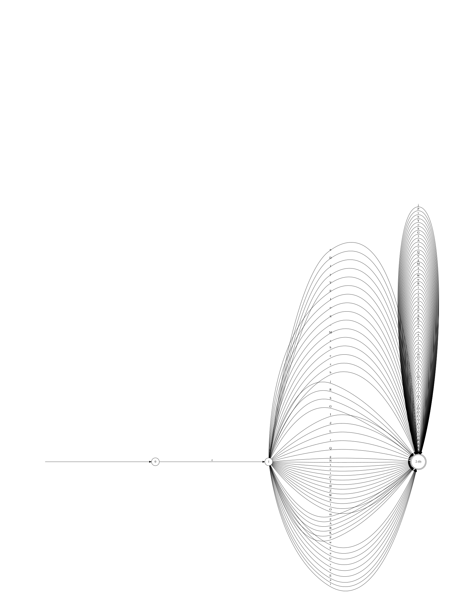
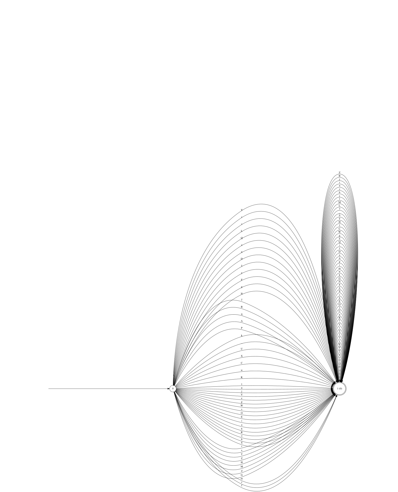

<div style="text-align: center; padding: 20px 0;">
  
</div>

<div style="text-align: center; margin-bottom: 1rem;">
  
  
  
  
  
  
</div>

# **Lexer Library**

`lexer` is a **modern C++23 library** for building fast, flexible lexical analyzers. Tokens are defined with a small
regex-like combinator DSL, compiled through Thompson construction, subset construction and Hopcroft-style DFA
minimization, and executed by a cache-optimized table simulator. There are no predefined tokens or grammars — you
describe the language, the library builds the automaton.

## **Features**

- **Fully User-Defined Tokens**

  No built-in keyword or literal set. Every token is a pattern plus a priority you register yourself, so the library
  adapts to any language or custom syntax without forking it.

- **Regex-like Combinators, Not a Regex String**

  Token patterns are built from composable, typed combinator functions (`concat`, `choice`, `plus`, `kleene`,
  `optional`, `exact`, `at_least`, `range`, `any_of`, `text`) instead of a parsed regex string — patterns are checked
  by the compiler and can be built, stored, and reused as ordinary C++ values.

- **A Real Automata Pipeline, Not a Backtracking Matcher**

  Each pattern becomes an NFA (Thompson construction), is determinized (subset construction) and minimized on its own,
  then all patterns are recombined and the whole lexer is determinized and minimized once more. Matching an input is
  always a single deterministic pass with no backtracking.

- **A Simulator Built for Throughput**

  The minimized DFA is compiled into flat transition tables with input symbols grouped into equivalence classes, so
  advancing the automaton on a character is one table read rather than a hash lookup or a graph walk. See
  [Performance](#performance).

- **Two Tokenization Layers**

  A low-level `core::Lexer` for single-shot, longest-match tokenization over an iterator range or container, and a
  `tools::tokenizer::Tokenizer` on top of it that streams a whole input into a sequence of tokens with position
  tracking and structured errors.

- **Graphviz Export for Debugging**

  Any NFA or DFA the library builds can be dumped to Graphviz DOT and rendered to SVG, which is how the diagrams in
  this README were produced.

- **Lightweight to Integrate**

  Builds as a set of static libraries with `FetchContent`-managed dependencies; add it with `add_subdirectory` and
  link `lexer`.

## **How It Works**

Building a lexer is a pipeline from combinators down to a flat table, run once by `Builder::build()`:

```
regex combinators ──▶ NFA (Thompson construction)
                          │  per pattern
                          ▼
                    subset construction ──▶ per-pattern DFA ──▶ minimize
                          │
                          ▼  convert back to NFA, union all patterns (ε-transitions)
                    merged NFA
                          │
                          ▼
                    subset construction ──▶ DFA ──▶ minimize ──▶ final DFA
                          │
                          ▼
                    Simulator (flat tables, symbol equivalence classes)
```

1. **Regex → NFA.** Each combinator (`concat`, `choice`, `kleene`, ...) knows how to lower itself to an
   `nfa::Builder` fragment; composing combinators composes NFA fragments.
2. **Per-pattern determinization.** Every registered pattern's NFA is independently turned into a DFA by subset
   construction and minimized. This resolves the non-determinism a single pattern's own combinators introduce (e.g.
   the branching in `choice` or the loop in `kleene`) before patterns ever interact.
3. **Recombination.** Each minimized per-pattern DFA is converted back into an NFA fragment carrying its token, and
   all fragments are unioned into one NFA via an ε-transition from a shared start state (Thompson-style union) —
   this is what lets multiple tokens share a lexer.
4. **Final determinization.** The merged NFA is determinized and minimized once more. This is the step that resolves
   *cross-pattern* ambiguity — shared prefixes between an identifier and a keyword, for instance — using each
   token's priority (lower value wins) to pick a winner when several patterns accept the same input.
5. **Compilation to tables.** `core::Lexer` wraps the final DFA in a `dfa::Simulator`, which compiles it into
   flat `(class, state) → state` and `state → token` tables (see [Performance](#performance)) instead of running the
   DFA against the maps it was built from.

Because determinization and minimization run twice — once per pattern, once for the whole lexer — the final DFA is
never larger than it needs to be, and adding a token only re-triggers the second pass, not the first.

## **Performance**

`core::Lexer::tokenize` advances the DFA through `dfa::Simulator::run`, which turns matching a character into one
table read on the hot path:

- **Symbol equivalence classes.** Two input bytes that the automaton never tells apart (e.g. two digits, in a lexer
  with no per-digit tokens) share one row of the transition table, so the table doesn't need one row per possible
  `char` value — only one per class the automaton actually distinguishes.
- **A flat `(class, state)` table**, viewed as a 2D `mdspan`, replaces the `unordered_map<(state, Label), state>`
  the DFA itself is built and inspected through. The class of the next symbol is known before the current state is,
  so the row offset is computed off the state-to-state dependency chain that would otherwise limit how fast `run()`
  can advance.
- **Narrow table entries** (`uint32_t` state indices, `uint8_t` class indices) keep more of the table resident in
  cache than the `size_t`-keyed hash map would.

Measured with `tools/benchmark` (Release build, GCC 13.3, WSL2) tokenizing generated C-like source:

```
$ cmake -S . -B build -DCMAKE_BUILD_TYPE=Release
$ cmake --build build -j 8 --target lexer_benchmark
$ ./build/tools/benchmark/lexer_benchmark 16 15
input: 16.0 MiB, tokens: 9144476, best of 15 passes: 495.6 MiB/s
```

Numbers depend on the machine and the token set — rerun the benchmark on your own hardware and language before
citing it. `tools/benchmark/src/main.cpp` builds a small C-like lexer exercising every combinator kind and generates
a fixed-seed, deterministic input so runs are comparable across changes.

## **Architecture Overview**

| Module                       | Responsibility                                                                                       |
|-------------------------------|-------------------------------------------------------------------------------------------------------|
| `lexer::regex`                | The combinator DSL (`concat`, `choice`, `kleene`, `any_of`, `text`, ...) and `Regex` → NFA lowering.  |
| `lexer::nfa`                  | `Nfa` / `nfa::Builder`: NFA representation, epsilon closures, Thompson-style append/merge.            |
| `lexer::dfa`                  | `Dfa` / `dfa::Builder`: DFA representation; `minimize()` (Moore partition refinement); `Simulator`.   |
| `lexer::core`                 | `Builder`: runs the full pipeline described above; `Lexer`: the public, one-shot matching API.        |
| `lexer::tools::tokenizer`     | `Tokenizer`: streaming wrapper over `core::Lexer` with offsets, EOF, and structured errors.           |
| `lexer::nfa::tools` / `lexer::dfa::tools` | `Graphviz`: DOT export for NFAs and DFAs, used to render the diagrams below.               |
| `lexer::common`                | Shared concepts (`Iterator`, `Iterable`) used across the other modules.                               |

## **Usage Overview**

### **Defining Token Kinds**

Token kinds are defined as an `enum` or as an integer type directly. Each token kind corresponds to a specific token:

```cpp
enum class Token_kind : uint8_t
{
    // Keywords
    Boolean,
    Char,
    String,
    Int8,
    Uint8,
    Int16,
    Uint16,
    Int32,
    Uint32,
    Int64,
    Uint64,

    // Identifier
    Identifier,

    // Literals
    Integer_literal,
    String_literal,
    Wide_string_literal,
    Character_literal,
    Wide_character_literal,
    Fixed_point_literal,
    Floating_point_literal,

    // Comments
    Single_line_comment,
    Multi_line_comment,
};
```

### **Defining Tokens**

#### **1. Combinator Functions**

Token patterns are built using a small, composable DSL inspired by regular expressions. Each combinator produces a
*pattern object* that can be freely combined with other patterns and later registered with the `Builder`.

Patterns are immutable, lightweight value objects and can be reused across multiple token definitions.

##### **Primitive Combinators**

- `text("abc")`: Matches the exact character sequence `"abc"`.
- `any_of(set)`: Matches any single character contained in the provided character set.

##### **Structural Combinators**

- `concat(p1, p2, ...)`: Matches patterns sequentially from left to right.
- `choice(p1, p2, ...)`: Matches the first successful alternative among the provided patterns.

##### **Repetition Combinators**

- `plus(p)`: Matches one or more repetitions of `p`.
- `kleene(p)`: Matches zero or more repetitions of `p`.
- `optional(p)`: Matches zero or one occurrence of `p`.
- `exact(p, count)`: Matches exactly `count` repetitions of `p`.
- `at_least(p, min)`: Matches `min` or more repetitions of `p`.
- `range(p, min, max)`: Matches between `min` and `max` repetitions of `p`.

##### **Character Sets**

`any_of` takes a `regex::Set`, built from an initializer list, an explicit range, or one of the predefined character
classes: `Set::digits()`, `Set::alpha()`, `Set::alphanum()`, `Set::printable()`, `Set::escape()`, `Set::newline()`,
`Set::whitespace()`, `Set::all()`, or `Set::range(start, end)`. Sets combine with `+`/`+=` (union) and `-`/`-=`
(difference), including against single characters.

##### **Example**

```cpp
using namespace lexer::regex;

// Identifier: [A-Za-z_][A-Za-z0-9_]*
const auto identifier = concat(any_of(Set::alpha() + '_'), kleene(any_of(Set::alphanum() + '_')));
```

#### **2. Builder Methods**

The `lexer::core::Builder` is responsible for collecting token definitions and producing a deterministic lexer. It
represents the *construction phase* of the lexer pipeline described in [How It Works](#how-it-works).

Once `build()` is called, the resulting `Lexer` is immutable and safe to reuse across multiple inputs.

### add_token(pattern, kind, priority)

Registers a token definition composed of:

- `pattern`: a regex-like combinator expression,
- `kind`: a user-defined token kind (typically an enum),
- `priority`: an integer used to resolve ambiguities.

```cpp
builder.add_token(pattern, Token_kind::Identifier, 4);
```

#### Priority Semantics

- Lower priority values are matched first.
- If multiple token patterns match the same input prefix, the token with the *lowest* priority value is selected.
- Priority resolution is deterministic and performed during the final DFA construction, once all patterns share a
  single automaton.

This mechanism allows keyword tokens to override more general patterns such as identifiers.

### build()

```cpp
const auto lexer{builder.build()};
```

Finalizes the builder and constructs a `lexer::core::Lexer`, running the pipeline in [How It Works](#how-it-works):
per-pattern NFA construction and determinization, recombination via Thompson union, and a final subset construction
and minimization producing the DFA the returned `Lexer` simulates.

After calling `build()`:

- the builder should be treated as immutable,
- the returned lexer can be reused safely and efficiently,
- no further tokens can be added to the same lexer instance.

### Example

```cpp
using namespace lexer;
using namespace lexer::core;
using namespace lexer::regex;

Builder builder;

// Register keyword tokens
builder.add_token(text("boolean"), Token_kind::Boolean, 1);
builder.add_token(text("char"), Token_kind::Char, 1);

// Create and register identifier and literal tokens
const auto identifier{concat(any_of(Set::alpha() + '_'), kleene(any_of(Set::alphanum() + '_')))};
const auto integer_literal{plus(any_of(Set::digits()))};

builder.add_token(identifier, Token_kind::Identifier, 4);
builder.add_token(integer_literal, Token_kind::Integer_literal, 2);

// Build the lexer
const auto lexer{builder.build()};
```

- **Token Patterns**: Patterns can represent fixed strings (e.g., keywords) or complex regex-like expressions (e.g.
  identifiers, literals).
- **Priority**: Lower priority numbers are matched first, enabling conflict resolution for overlapping token patterns
  and ensuring the correct token is selected when multiple patterns match.

### **Tokenization**

Tokenization is performed either **directly through the core lexer** or via a **high-level tokenizer wrapper** that adds
streaming-based input support. This flexibility allows you to choose between performance-focused, one-shot matching or
convenient incremental processing.

The library provides two complementary ways to perform tokenization:

1. **Low-level, one-shot API** via `lexer::core::Lexer`
2. **High-level, streaming API** via `lexer::tools::tokenizer::Tokenizer`

#### **1. Core API (`lexer::core::Lexer`)**

The core lexer performs direct tokenization on containers or iterators. It returns a pair containing the recognized
token kind and the number of characters consumed.

```cpp
using namespace lexer;
using namespace lexer::core;
using namespace lexer::regex;

int main()
{
    enum class Token_kind : uint8_t
    {
        Boolean,
        Char,
        Identifier,
    };

    Builder builder;

    // Define tokens
    builder.add_token(text("boolean"), Token_kind::Boolean, 1);
    builder.add_token(text("char"), Token_kind::Char, 1);

    const auto identifier{concat(any_of(Set::alpha() + '_'), kleene(any_of(Set::alphanum() + '_')))};
    builder.add_token(identifier, Token_kind::Identifier, 4);

    const auto lexer{builder.build()};

    // Tokenize input
    const std::string input = "boolean";
    const auto [token, consumed] = lexer.tokenize<Token_kind>(input);

    std::cout << "Token: " << (token ? std::to_string(static_cast<int>(*token)) : "None") << ", Consumed: " << consumed << '\n';

    return 0;
}
```

You can pass a standard container such as `std::array`, `std::string`, or any range-like input.

```cpp
std::array<char, 5> input = {'1', '2', '3', '4', '\0'};
const auto [token, consumed] = lexer.tokenize<Token_kind>(input);

// token  -> Token_kind::Integer_literal
// consumed -> 4
```

Alternatively, you can tokenize a string using iterators:

```cpp
std::string input = "boolean";
const auto [token, consumed] = lexer.tokenize<Token_kind>(input.begin(), input.end());

// token  -> Token_kind::Boolean
// consumed -> 7
```

In both cases, the lexer returns:

- the **token kind** (`std::optional<Token_kind>`), which is empty if no valid token was matched, and
- the **offset**, representing the number of characters consumed during the match.

This API is efficient and lightweight, suitable for use in parsers or compiler front ends.

#### **2. Tokenizer API (`lexer::tools::tokenizer::Tokenizer`)**

The Tokenizer builds on the core lexer to provide a streaming-based interface. It repeatedly calls the underlying
`core::Lexer`, handling offsets, EOF detection, and error propagation automatically.

```cpp
using namespace lexer;
using namespace lexer::core;
using namespace lexer::regex;
using namespace lexer::tools::tokenizer;

const std::string input = "boolean x 1234";

Tokenizer tokenizer{lexer, input};

for (;;)
{
    const std::expected<std::optional<Token<Token_kind>>, Error> expected = tokenizer.next<Token_kind>();
    if (!expected.has_value())
    {
        // Invalid input or unrecognized symbol
        std::cerr << expected.error().message() << '\n';
        break;
    }

    const std::optional<Token<Token_kind>> optional = expected.value();
    if (!optional.has_value())
    {
        break; // End of input
    }

    const Token<Token_kind> token = optional.value();
    std::cout << "Token kind=" << static_cast<int>(token.kind()) << " lexeme=\"" << token.lexeme() << "\"\n";
}
```

The tokenizer API uses an expected-like result type:

- **Success**: Returns a value containing `std::optional<Token<Token_kind>>` with either the recognized token or EOF (
  `std::nullopt`).
- **Failure**: Returns an error object with position and textual description.

Together, these two layers let you choose between fine-grained control (`core::Lexer`) and convenient streaming-based
processing (`tools::tokenizer::Tokenizer`).

> **Note:** `Tokenizer` is not thread-safe, and `Token::lexeme()` is a `string_view` into the `Tokenizer`'s internal
> input buffer — it is invalidated by `load()` or by the `Tokenizer` being destroyed. Copy the lexeme to a
> `std::string` if a token needs to outlive either.

## **Getting Started**

### **Requirements**

- A C++23 compiler. Developed against GCC 13.3; GCC 13 has no native `<mdspan>`, which `external/mdspan` (the Kokkos
  reference implementation) supplies via `FetchContent`.
- CMake 3.20+.
- Everything else (`boost.config`/`describe`/`mp11`/`container_hash`, `mdspan`, `googletest`) is fetched by CMake at
  configure time; there is nothing to install manually. Pass `-DUSE_SYSTEM_BOOST=ON` / `-DUSE_SYSTEM_GTEST=ON` to use
  system packages instead.

### **Building the Project**

```bash
cmake -S . -B build
cmake --build build -j 8
```

Build in `Release` for anything performance-sensitive — the default `CMAKE_BUILD_TYPE` is `Release` when unset, but an
existing `build/` directory keeps whatever type it was first configured with.

## **Testing**

Every library and tool under `libs/` and `tools/` has its own GoogleTest suite in a `tests/` subdirectory, registered
with CTest. To run them all:

```bash
cd build
ctest --output-on-failure
```

Pass `-DLEXER_BUILD_TESTS=OFF` to `cmake` when configuring to skip building tests entirely, e.g. when consuming the
library as a dependency.

## **Directory Structure**

```
docs/                     SVG diagrams and project logos.
libs/
  common/                 Shared concepts (Iterator, Iterable) used across the other libraries.
  regex/                  The combinator DSL: Regex nodes and their lowering to lexer::nfa::Builder.
  nfa/                    NFA representation and builder (Thompson construction, epsilon closure, merge/append).
    tools/                Graphviz DOT export for NFAs.
  dfa/                    DFA representation, minimize() (Moore partition refinement), and the table-compiling Simulator.
    tools/                Graphviz DOT export for DFAs.
  core/                   Builder (drives the full pipeline) and Lexer (the public matching API).
tools/
  tokenizer/              Tokenizer: streaming wrapper over core::Lexer with offsets and structured errors.
  benchmark/               Throughput benchmark for core::Lexer::tokenize (see Performance).
```

## **Example CMake Integration**

Here's a sample `CMakeLists.txt` for integrating the `lexer` library:

```cmake
cmake_minimum_required(VERSION 3.20)
project(MyProject VERSION 1.0 LANGUAGES CXX)

set(CMAKE_CXX_STANDARD 23)
set(CMAKE_CXX_STANDARD_REQUIRED ON)

# Add the lexer library
add_subdirectory(lexer)

# Link the lexer library to your target
add_executable(my_app main.cpp)
target_link_libraries(my_app PRIVATE lexer)
```

The `lexer` target is an interface umbrella over `lexer_core` and `lexer_tokenizer`, which pull in `lexer_regex`,
`lexer_nfa`, `lexer_dfa`, and `lexer_common` transitively. To use the Graphviz debugging helpers described below, link
`lexer_nfa_tools` and/or `lexer_dfa_tools` directly — they are not part of the `lexer` umbrella target.

## **Debugging and Visualization**

### **Generating Debugging Files**

Debugging is a crucial step in understanding and verifying the behavior of the lexer. The library supports generating
`.dot` files for visualizing NFAs and DFAs, which can help identify issues or optimize the tokenization process. These
files can be converted to `.svg` for easier viewing.

1. Include the appropriate `graphviz` header for NFA or DFA.
2. Call the `to_file` method from the `Graphviz` class, passing the NFA or DFA object and the desired file path to
   generate `.dot` files for debugging.

#### **Converting `.dot` to `.svg`**

Use the `dot` command-line tool from Graphviz to convert `.dot` files to `.svg`:

```bash
dot -Tsvg <name>.dot -o <name>.svg
```

> **Note**: Ensure Graphviz is installed on your system before running these commands. You can download it
> from [Graphviz.org](https://graphviz.org/download/).

### **Visualizing NFAs and DFAs**

Below are examples of how an NFA and its corresponding DFA might look:

#### **Identifier NFA Example**



This image represents the NFA for recognizing identifiers. It shows the states and transitions based on the input
characters. NFAs are useful for understanding the non-deterministic paths that the lexer can take when matching
patterns.

#### **Identifier DFA Example**



This image illustrates the DFA derived from the NFA above. DFAs are deterministic and optimized for fast tokenization,
showcasing the subset construction process and the deterministic transitions.

#### **Floating Point Literal NFA Example**


This NFA visualizes the recognition of floating point literals, demonstrating the complexity of matching numeric
patterns with optional decimal points and exponents.

#### **Floating Point Literal DFA Example**


This DFA is constructed from the floating point literal NFA and shows the deterministic state transitions required to
efficiently recognize floating point numbers.

#### **DFA Minimization Example**

Subset construction builds the DFA for `choice(text("let"), text("set"))` with a separate branch per alternative:


Subset construction cannot merge these branches itself: it identifies states reached by the same input prefixes, and
these alternatives share none. Their redundancy lies in the shared suffix, i.e. in their futures, which is exactly
what minimization examines: it merges every pair of states no remaining input can distinguish. The two accept states
are interchangeable, and so are the interior states of the two branches pair by pair, collapsing the automaton into a
single shared chain:


States accepting different tokens are never merged, so tokenization is unchanged. The builder minimizes after each
subset construction, so every DFA it produces is minimal; smaller automata also shrink the transition tables the
simulator compiles, keeping more of them in cache.

## **License**

This project is licensed under the terms of the MIT License. See the [LICENSE](LICENSE) file for details.

## **Author**

Developed and maintained by **Nicklas Nidhögg**  
GitHub: [nnidhogg](https://github.com/nnidhogg)
