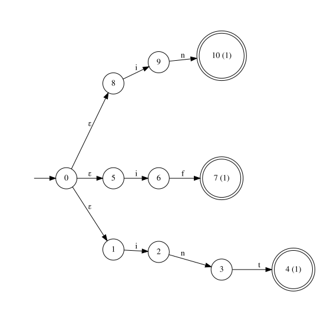
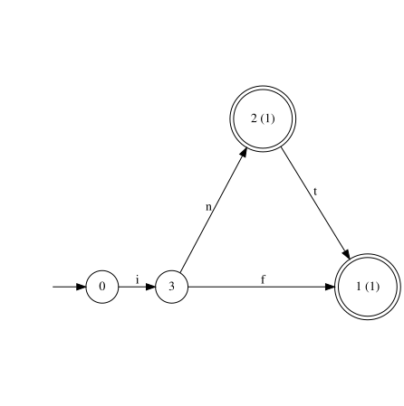
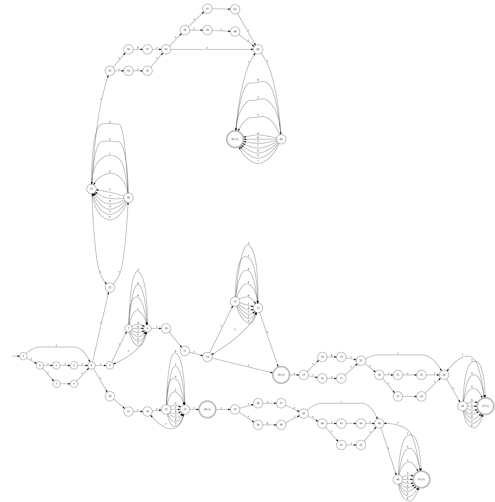
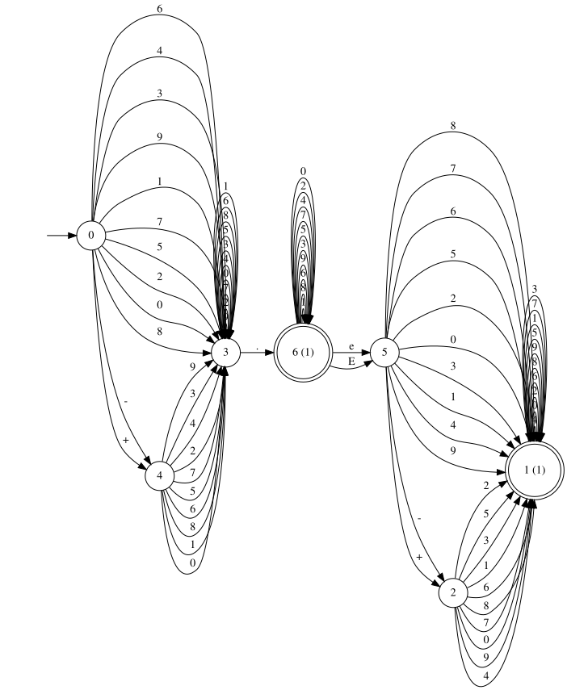
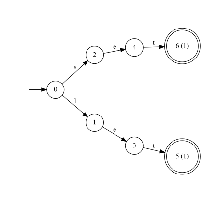
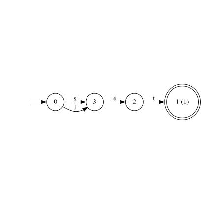

# **Munch**

<p align="center">
  
  
  
  
  
  
</p>

`munch` is a **modern C++23 library** for building fast, flexible lexical analyzers. Tokens are defined with a small
regex-like combinator DSL, compiled through Thompson construction, subset construction, and DFA minimization by Moore
partition refinement, then executed by a cache-optimized table simulator. There are no predefined tokens or grammars.
You describe the language, and the library builds the automaton. On
the [comparison below](#comparison-with-other-engines), that automaton measures as the fastest lexer constructed at run
time in either measured language, on both benchmark corpora; only compile-time code generation measures ahead. The
compiled table also certifies which bytes are safe chunk boundaries, so large inputs can be split and scanned in
parallel with strong scaling and a provably identical token stream, a guarantee the code-generating lexers cannot give
about their own token sets.

The name is pronounced /mʊŋk/, like "munk", after the
painter [Edvard Munch](https://en.wikipedia.org/wiki/Edvard_Munch); that it also reads as the English *munch* /mʌntʃ/,
as in the maximal munch rule every lexer lives by, is the pun.

## **Features**

- **Fully User-Defined Tokens**

  No built-in keyword or literal set. Every token is a pattern plus a priority you register yourself, so the library
  adapts to any language or custom syntax without forking it.

- **Regex-like Combinators, Not a Regex String**

  Token patterns are built from composable, typed combinator functions (`concat`, `choice`, `plus`, `kleene`,
  `optional`, `exact`, `at_least`, `range`, `any_of`, `text`) instead of a parsed regex string. Patterns are checked by
  the compiler and can be built, stored, and reused as ordinary C++ values. `utf8::range` matches Unicode code point
  ranges by expanding them into byte sequences, so the engine itself stays byte-oriented.

- **A Real Automata Pipeline, Not a Backtracking Matcher**

  Each pattern becomes an NFA (Thompson construction), is determinized (subset construction) and minimized on its own,
  then all patterns are recombined and the whole lexer is determinized and minimized once more. Matching an input is
  always a single deterministic pass with no backtracking.

- **A Simulator Built for Throughput**

  The minimized DFA is compiled into flat transition tables with input symbols grouped into equivalence classes, so
  advancing the automaton on a character is one table read rather than a hash lookup or a graph walk. See
  [Performance](#performance).

- **Two Tokenization Layers**

  A low-level `core::Lexer` for single-shot, longest-match tokenization over an iterator range or container, and a
  `tools::tokenizer::Tokenizer` on top of it that streams a whole input into a sequence of tokens with position tracking
  and structured errors. The tokenizer also carries the primitives real languages need: several lexers as modes over one
  input, a seek escape hatch for hand-scanned tokens, and a scanner for C++ raw string literals.

- **Graphviz Export for Debugging**

  Any NFA or DFA the library builds can be dumped to Graphviz DOT and rendered to SVG, which is how the diagrams in this
  README were produced.

- **Lightweight to Integrate**

  Builds as a set of static libraries with `FetchContent`-managed dependencies. Add it with `add_subdirectory`, or
  install it and `find_package(munch)`; either way, link `munch::munch`. The installed package is self-contained, with
  no third-party dependencies in its public headers.

## **How It Works**

Building a lexer is a pipeline from combinators down to a flat table, run once by `Builder::build()`:

```
regex combinators ──▶ NFA (Thompson construction)
                          │  per pattern
                          ▼
                    subset construction ──▶ per-pattern DFA ──▶ minimize
                          │
                          ▼  convert back to NFA, union all patterns (ε-transitions)
                    merged NFA
                          │
                          ▼
                    subset construction ──▶ DFA ──▶ minimize ──▶ final DFA
                          │
                          ▼
                    Simulator (flat tables, symbol equivalence classes)
```

1. **Regex → NFA.** Each combinator (`concat`, `choice`, `kleene`, ...) knows how to lower itself to an
   `nfa::Builder` fragment; composing combinators composes NFA fragments.
2. **Per-pattern determinization.** Every registered pattern's NFA is independently turned into a DFA by subset
   construction and minimized. This resolves the non-determinism a single pattern's own combinators introduce (e.g. the
   branching in `choice` or the loop in `kleene`) before patterns ever interact.
3. **Recombination.** Each minimized per-pattern DFA is converted back into an NFA fragment carrying its token, and the
   fragments are united into one NFA under a single fresh start state that ε-links to every fragment. This union is what
   lets multiple tokens share a lexer.
4. **Final determinization.** The merged NFA is determinized and minimized once more. This is the step that resolves
   *cross-pattern* ambiguity, such as shared prefixes between an identifier and a keyword, using each token's priority
   (lower value wins) to pick a winner when several patterns accept the same input.
5. **Compilation to tables.** `core::Lexer` wraps the final DFA in a `dfa::Simulator`, which compiles it into flat
   `(class, state) → state` and `state → token` tables (see [Performance](#performance)) instead of running the DFA
   against the maps it was built from.

Determinization and minimization run twice, once per pattern and once for the whole lexer, so the final DFA is never
larger than it needs to be. The first pass depends only on its own pattern, so adding a token changes nothing in what
the other patterns lower to; `build()` runs both passes each time it is called.

## **Performance**

`core::Lexer::tokenize` advances the DFA through `dfa::Simulator::run`, which turns matching a character into one table
read on the hot path:

- **Symbol equivalence classes.** Two input bytes that the automaton never tells apart (e.g. two digits, in a lexer with
  no per-digit tokens) share one row of the transition table. The table therefore needs one row per class the automaton
  actually distinguishes rather than one per possible `char` value.
- **A flat `(class, state)` table**, viewed as a 2D `mdspan`, replaces the `unordered_map<(state, Label), state>`
  the DFA itself is built and inspected through. The class of the next symbol is known before the current state is, so
  the row offset is computed off the state-to-state dependency chain that would otherwise limit how fast `run()`
  can advance.
- **Narrow table entries** (`uint32_t` state indices, `uint8_t` class indices) keep more of the table resident in cache
  than the `size_t`-keyed hash map would.

The design rationale, i.e. why a library this small outruns engines orders of magnitude larger, is written up in
[docs/performance.md](docs/performance.md); the architectural decisions behind it are collected in
[docs/design.md](docs/design.md).

Measured with `tools/benchmark` (Release build, GCC 13.3, WSL2 on an Intel i9-12900K) over generated pseudo-code. Every
scenario reports its best, median, and worst pass: the best estimates the least-interrupted cost of the work, and the
spread to the worst is the run-to-run variability, system interference plus, for the threaded scenarios, thread creation
and scheduling.

```
$ cmake -S . -B build -DCMAKE_BUILD_TYPE=Release
$ cmake --build build -j 8 --target munch_benchmark
$ ./build/tools/benchmark/munch_benchmark 16 15
lexer/ascii      16.0 MiB, 9144476 tokens, 15 passes: best 508.6, median 497.1, worst 471.1 MiB/s
lexer_all/ascii  16.0 MiB, 9144476 tokens, 15 passes: best 584.6, median 572.2, worst 555.7 MiB/s
tokenizer/ascii  16.0 MiB, 9144476 tokens, 15 passes: best 447.2, median 440.5, worst 427.9 MiB/s
lexer_all/utf8   16.0 MiB, 8320312 tokens, 15 passes: best 567.3, median 564.0, worst 546.4 MiB/s
lexer_all/xid    16.0 MiB, 8320312 tokens, 15 passes: best 568.3, median 554.0, worst 523.2 MiB/s
build/keywords   143 patterns, 251 states, 15 passes: best 21.8, median 22.7, worst 24.9 ms
register/xid     3 patterns, 477 states, 15 passes: best 59.2, median 64.1, worst 75.5 ms
build/xid        3 patterns, 477 states, 15 passes: best 432.3, median 459.2, worst 534.1 ms
total/xid        3 patterns, 477 states, 15 passes: best 495.2, median 522.4, worst 602.1 ms
lexer_all/source 16.0 MiB, 4755600 tokens, 15 passes: best 581.4, median 569.0, worst 514.1 MiB/s
chunked2/ascii   16.0 MiB, 9144476 tokens, 15 passes: best 1035.0, median 1003.6, worst 946.7 MiB/s
chunked2/source  16.0 MiB, 4755600 tokens, 15 passes: best 987.9, median 971.2, worst 903.4 MiB/s
chunked4/ascii   16.0 MiB, 9144476 tokens, 15 passes: best 1987.8, median 1928.5, worst 1817.1 MiB/s
chunked4/source  16.0 MiB, 4755600 tokens, 15 passes: best 1934.3, median 1887.1, worst 1626.7 MiB/s
chunked8/ascii   16.0 MiB, 9144476 tokens, 15 passes: best 3008.9, median 2797.6, worst 2506.3 MiB/s
chunked8/source  16.0 MiB, 4755600 tokens, 15 passes: best 3294.3, median 3066.8, worst 2805.0 MiB/s
```

The scenarios measure the core lexer called once per token on C-like source, the same input through the batch
`tokenize_all()` entry point, which keeps the scan state live across token boundaries, the `Tokenizer` driver,
identifiers containing UTF-8 code points matched through byte expansion, the same input through the full Unicode XID
identifier classes (`lexer_all/xid` tracks `lexer_all/utf8` within noise: the class size is paid at construction, never
per byte), the keyword-scale build cost, the XID construction cost split into registration, finalization, and their
total, and the parallel chunked scans at certified split points on two, four, and eight threads. Inputs are fixed-seed
and deterministic, so runs are comparable across changes. Numbers depend on the machine, the token set, and the
compiler: these are GCC 13 builds, and Clang 19 measures within about ten percent since the accept path was pinned to a
branch (see [docs/performance.md](docs/performance.md)). WSL2 adds visible run-to-run spread, so rerun the benchmark on
your own hardware and language before citing them.

### **Comparison with Other Engines**

Configuring with `-DMUNCH_BENCHMARK_COMPARE=ON` additionally builds `munch_benchmark_compare`, which runs the same
tokenization job through six engines: lexertl17 (the C++17 line of lexertl), munch's nearest relative, a lexer likewise
built at run time from rules and compiled to a DFA, and five widely used regex engines, used the way one uses a regex
engine to write a lexer: one pattern with an alternation per token kind, matched anchored at the current offset. Each
engine's full tokenization, every token's kind and length, is validated to agree with munch's before anything is timed;
the timed passes then run a lightweight recognition tally of token count and kinds. The option is off by default because
it fetches the engines as additional dependencies.

Two corpus shapes keep the conclusions honest: `dense`, averaging under two bytes per token, magnifies per-token
overhead, and `source`, shaped like real code with long identifiers and indentation, amortizes it.

```
$ cmake -S . -B build -DCMAKE_BUILD_TYPE=Release -DMUNCH_BENCHMARK_COMPARE=ON
$ cmake --build build -j 8 --target munch_benchmark_compare
$ ./build/tools/benchmark/munch_benchmark_compare 16 15
corpus dense: 1.83 bytes per token
munch            16.0 MiB, 9144476 tokens, 15 passes: best 577.0, median 563.6, worst 555.1 MiB/s
munch-mt4        16.0 MiB, 9144476 tokens, 15 passes: best 2035.0, median 1973.4, worst 1474.1 MiB/s
munch-mt8        16.0 MiB, 9144476 tokens, 15 passes: best 3755.4, median 3410.3, worst 2445.8 MiB/s
lexertl          16.0 MiB, 9144476 tokens, 15 passes: best 175.7, median 173.2, worst 168.6 MiB/s
ctre             16.0 MiB, 9144476 tokens, 15 passes: best 421.4, median 414.6, worst 374.9 MiB/s
pcre2-jit        16.0 MiB, 9144476 tokens, 15 passes: best 79.9, median 78.2, worst 77.3 MiB/s
re2              16.0 MiB, 9144476 tokens, 15 passes: best 11.2, median 11.0, worst 10.8 MiB/s
boost-regex      16.0 MiB, 9144476 tokens, 15 passes: best 15.5, median 15.3, worst 15.0 MiB/s
std-regex        16.0 MiB, 9144476 tokens, 15 passes: best 10.9, median 10.9, worst 10.8 MiB/s
corpus source: 3.53 bytes per token
munch            16.0 MiB, 4755600 tokens, 15 passes: best 563.8, median 547.6, worst 529.0 MiB/s
munch-mt4        16.0 MiB, 4755600 tokens, 15 passes: best 2075.6, median 2018.1, worst 1868.8 MiB/s
munch-mt8        16.0 MiB, 4755600 tokens, 15 passes: best 3873.3, median 3444.5, worst 2997.5 MiB/s
lexertl          16.0 MiB, 4755600 tokens, 15 passes: best 223.6, median 220.5, worst 218.4 MiB/s
ctre             16.0 MiB, 4755600 tokens, 15 passes: best 575.3, median 564.8, worst 544.6 MiB/s
pcre2-jit        16.0 MiB, 4755600 tokens, 15 passes: best 139.8, median 137.1, worst 133.6 MiB/s
re2              16.0 MiB, 4755600 tokens, 15 passes: best 19.1, median 18.9, worst 18.7 MiB/s
boost-regex      16.0 MiB, 4755600 tokens, 15 passes: best 28.4, median 28.1, worst 27.8 MiB/s
std-regex        16.0 MiB, 4755600 tokens, 15 passes: best 16.4, median 16.2, worst 16.1 MiB/s
```

The same job runs through Rust's lexer class in `tools/benchmark/rust`, whose corpus generators are byte-identical ports
and whose tally matches the one above, so the numbers are comparable across the two binaries. It measures logos, the
code-generating lexer, and the dense DFAs of regex-automata, the nearest Rust relative of munch's runtime-construction
class, both through its search API and steelmanned through its low-level automaton walk:

```
$ cd tools/benchmark/rust && cargo run --release -- 16 15
corpus dense: 1.83 bytes per token
logos            16.0 MiB, 9144476 tokens, 15 passes: best 728.0, median 691.5, worst 665.3 MiB/s
logos-mt4        16.0 MiB, 9144476 tokens, 15 passes: best 2708.0, median 2640.2, worst 2307.8 MiB/s
logos-mt8        16.0 MiB, 9144476 tokens, 15 passes: best 5148.9, median 4742.7, worst 3283.3 MiB/s
regex-automata   16.0 MiB, 9144476 tokens, 15 passes: best 168.2, median 166.5, worst 155.2 MiB/s
regex-automata-raw 16.0 MiB, 9144476 tokens, 15 passes: best 349.1, median 346.9, worst 340.9 MiB/s
corpus source: 3.53 bytes per token
logos            16.0 MiB, 4755600 tokens, 15 passes: best 891.1, median 858.8, worst 833.5 MiB/s
logos-mt4        16.0 MiB, 4755600 tokens, 15 passes: best 3462.0, median 3290.0, worst 2854.9 MiB/s
logos-mt8        16.0 MiB, 4755600 tokens, 15 passes: best 6141.5, median 5487.2, worst 4131.6 MiB/s
regex-automata   16.0 MiB, 4755600 tokens, 15 passes: best 222.3, median 219.7, worst 215.8 MiB/s
regex-automata-raw 16.0 MiB, 4755600 tokens, 15 passes: best 399.1, median 392.8, worst 352.4 MiB/s
```

The engines fall into three groups, and each group is in the comparison to answer a different question.

**The same class: lexers constructed at run time.** These share munch's contract, a token set supplied as data while the
program runs, so they are the alternatives munch directly competes with, and the group the claim of fastest in its class
is measured against. regex-automata appears twice deliberately: once through its search API as a user would call it, and
once steelmanned through its low-level automaton walk, so the claim holds against the best the library can do rather
than its friendliest entry point.

| Engine                 | Version   | Matching approach                       | dense | source |
|------------------------|-----------|-----------------------------------------|------:|-------:|
| `munch`                | this repo | table-compiled minimal DFA, single pass |   577 |    564 |
| `regex-automata` (raw) | 0.4       | dense DFA walked at the automaton level |   349 |    399 |
| lexertl17              | 652435f   | rules compiled to a DFA                 |   176 |    224 |
| `regex-automata`       | 0.4       | dense DFA through its search API        |   168 |    222 |

**The class above: compile-time code generation.** These freeze the token set at build time and emit code shaped like
it, the one advantage a runtime-built table cannot take, so this group does not measure a competition munch can enter;
it measures the price of munch's flexibility. Across measurement sessions on the reference machine, that price has
ranged from under ten percent to roughly a quarter against logos on dense input, and from forty to sixty percent on
source-shaped input: gaps between separately built binaries move with machine state, which the best-to-worst spread in
the raw output makes visible. Membership in this class is not sufficient to win, though: munch outruns CTRE outright on
the dense corpus, because CTRE compiles the regex structure into code and still resolves the alternation between token
kinds per token, while munch's determinized table erased the alternation before the first byte arrived. Only when longer
tokens let generated code consume multi-byte runs does CTRE pull ahead.

| Engine  | Version   | Matching approach                       | dense | source |
|---------|-----------|-----------------------------------------|------:|-------:|
| logos   | 0.15.1    | matcher generated by a derive macro     |   728 |    891 |
| `munch` | this repo | table-compiled minimal DFA, single pass |   577 |    564 |
| CTRE    | 3.9.0     | matcher generated from the regex        |   421 |    575 |

**The industry defaults: general-purpose regex engines.** This is what a codebase typically reaches for when it needs a
tokenizer without adopting a lexer library, so the group measures what that convenience costs. The gap is not a defect
in these engines: they solve a far broader problem, searching, captures, backreferences, and they pay for that
generality on a workload of anchored matches every couple of bytes.

| Engine       | Version        | Matching approach                       | dense | source |
|--------------|----------------|-----------------------------------------|------:|-------:|
| `munch`      | this repo      | table-compiled minimal DFA, single pass |   577 |    564 |
| PCRE2        | 10.44          | backtracking, JIT-compiled              |    80 |    140 |
| Boost.Regex  | 1.86.0         | backtracking                            |    16 |     28 |
| RE2          | 2024-07-02     | Thompson NFA when extracting captures   |    11 |     19 |
| `std::regex` | libstdc++ 13.3 | backtracking                            |    11 |     16 |

With the input chunked at safe split points and scanned with one thread per chunk, for the two lexer classes fast enough
for threading to matter:

| Engine  | Threads | dense | source |
|---------|--------:|------:|-------:|
| logos   |       8 |  5149 |   6142 |
| `munch` |       8 |  3755 |   3873 |
| logos   |       4 |  2708 |   3462 |
| `munch` |       4 |  2035 |   2076 |

Best-pass throughputs in MiB/s; the raw blocks above carry the medians and the spread, and the medians tell the same
story throughout.

Read the numbers for what they measure. The corpus averages under two bytes per token, so per-token overhead dominates:
munch tokenizes the whole input through `tokenize_all()`, CTRE compiles the token set into a matcher at C++ compile
time, and the general-purpose engines re-enter a full match API for every token (PCRE2 through its dedicated JIT entry
point, `pcre2_jit_match`). RE2 must answer capture-group queries through its NFA rather than its faster DFA, and both
RE2 and PCRE2 are designed for searching long texts, not for anchored matches every couple of bytes. The comparison
pattern orders keywords before identifiers and multi-character operators before their prefixes, so the engines with
first-match alternation semantics produce exactly munch's longest-match, priority-resolved tokenization.

Read as classes, the two corpora say one thing together. munch is the fastest lexer constructed at run time on both,
roughly 1.4 to 3.3 times ahead of its nearest relatives even with regex-automata steelmanned through its low-level walk,
the narrow end being that steelman on the source-shaped corpus. The compile-time code generators own the overall lead as
tokens grow longer: logos on both corpora and CTRE on source, because generated code consumes multi-byte runs where a
table walk pays one dependent load per byte, which is also why munch's own throughput is nearly identical on both corpus
shapes.
[docs/performance.md](docs/performance.md) explains why that boundary is where it is.

Threading multiplies the class verdict rather than reordering it: both lexer classes scale strongly, close to linear at
four threads and sublinearly at eight, so the serial ranking carries over at every width. What the threaded rows
actually compare is how each side knows its chunk boundaries are safe. munch certifies them from the compiled transition
table, for whatever token set was built, through
`is_split_point()`; the logos rows rest on a hand-written analysis of this one token set, documented in the Rust driver,
which logos itself can neither produce nor check. On a token set where no byte is safe, such as one with string
literals, munch reports that no split points exist, while a hand analysis has to notice by itself that the trick is no
longer sound.

## **Architecture Overview**

| Module                                    | Responsibility                                                                                        |
|-------------------------------------------|-------------------------------------------------------------------------------------------------------|
| `munch::regex`                            | The combinator DSL (`concat`, `choice`, `kleene`, `any_of`, `text`, ...) and `Regex` → NFA lowering.  |
| `munch::nfa`                              | `Nfa` / `nfa::Builder`: NFA representation, epsilon closures, Thompson-style append/merge.            |
| `munch::dfa`                              | `Dfa` / `dfa::Builder`: DFA representation; `minimize()` (Moore partition refinement); `Simulator`.   |
| `munch::core`                             | `Builder`: runs the full pipeline described above; `Lexer`: the public, one-shot matching API.        |
| `munch::tools::tokenizer`                 | `Tokenizer`: streaming driver over `core::Lexer` with modes, offsets, seek, and a raw string scanner. |
| `munch::nfa::tools` / `munch::dfa::tools` | `Graphviz`: DOT export for NFAs and DFAs, used to render the diagrams below.                          |
| `munch::common`                           | Shared concepts (`Iterator`, `Iterable`) used across the other modules.                               |

## **Usage Overview**

### **Defining Token Kinds**

Token kinds are defined as an `enum` or as an integer type directly. Each token kind corresponds to a specific token:

```cpp
enum class Token_kind : uint8_t
{
    // Keywords
    Boolean,
    Char,
    String,
    Int8,
    Uint8,
    Int16,
    Uint16,
    Int32,
    Uint32,
    Int64,
    Uint64,

    // Identifier
    Identifier,

    // Literals
    Integer_literal,
    String_literal,
    Wide_string_literal,
    Character_literal,
    Wide_character_literal,
    Fixed_point_literal,
    Floating_point_literal,

    // Comments
    Single_line_comment,
    Multi_line_comment,
};
```

### **Defining Tokens**

#### **1. Combinator Functions**

Token patterns are built using a small, composable DSL inspired by regular expressions. Each combinator produces a
*pattern object* that can be freely combined with other patterns and later registered with the `Builder`.

Patterns are ordinary value objects and can be reused across multiple token definitions; copies are deep, so prefer
moving large generated patterns such as the XID classes.

##### **Primitive Combinators**

- `text("abc")`: Matches the exact character sequence `"abc"`.
- `any_of(set)`: Matches any single character contained in the provided character set.

##### **Structural Combinators**

- `concat(p1, p2, ...)`: Matches patterns sequentially from left to right.
- `choice(p1, p2, ...)`: Matches any of the provided alternatives. The alternatives form one automaton, so there is no
  ordering or preference among them; the lexer always takes the longest match overall.

##### **Repetition Combinators**

- `plus(p)`: Matches one or more repetitions of `p`.
- `kleene(p)`: Matches zero or more repetitions of `p`.
- `optional(p)`: Matches zero or one occurrence of `p`.
- `exact(p, count)`: Matches exactly `count` repetitions of `p`.
- `at_least(p, min)`: Matches `min` or more repetitions of `p`.
- `range(p, min, max)`: Matches between `min` and `max` repetitions of `p`.

##### **Character Sets**

`any_of` takes a `regex::Set`, built from an initializer list, an explicit range, or one of the predefined character
classes: `Set::digits()`, `Set::alpha()`, `Set::alphanum()`, `Set::printable()`, `Set::escape()`, `Set::newline()`,
`Set::whitespace()`, `Set::all()`, or `Set::range(start, end)`. Sets combine with `+`/`+=` (union) and `-`/`-=`
(difference), including against single characters.

For Unicode input, `utf8::range(first, last)` from `munch/regex/utf8.hpp` matches one code point from an inclusive
range, expanded into its UTF-8 byte sequences. Surrogates are excluded, and ill-formed input such as overlong encodings
is rejected by construction. `utf8::ranges()` matches one code point from a sorted list of disjoint ranges, and
`munch/regex/unicode.hpp` provides `unicode::xid_start()` and `unicode::xid_continue()`, the UAX #31 identifier
properties generated from the Unicode Character Database (`unicode::version()` names the pinned version). A C-style
identifier is then `concat(choice(text('_'), unicode::xid_start()), kleene(unicode::xid_continue()))`; underscore
already holds XID_Continue, so only the head needs the profile choice. The properties themselves are matched exactly.

##### **Example**

```cpp
using namespace munch::regex;

// Identifier: [A-Za-z_][A-Za-z0-9_]*
const auto identifier = concat(any_of(Set::alpha() + '_'), kleene(any_of(Set::alphanum() + '_')));
```

#### **2. Builder Methods**

The `munch::core::Builder` is responsible for collecting token definitions and producing a deterministic lexer. It
represents the *construction phase* of the lexer pipeline described in [How It Works](#how-it-works).

Once `build()` is called, the resulting `Lexer` is immutable and safe to reuse across multiple inputs.

##### **add_token (pattern, kind, priority)**

Registers a token definition composed of:

- `pattern`: a regex-like combinator expression,
- `kind`: a user-defined token kind (typically an enum),
- `priority`: an integer used to resolve ambiguities.

```cpp
builder.add_token(pattern, Token_kind::Identifier, 4);
```

##### **Priority Semantics**

- Matching is always longest-match first; priorities never shorten or reorder a match.
- When several token patterns accept the same longest match, the token with the *lowest* priority value is selected.
- Priority resolution is deterministic and performed during the final DFA construction, once all patterns share a single
  automaton.

This mechanism allows keyword tokens to override more general patterns such as identifiers.

##### **`build()`**

```cpp
const auto lexer{builder.build()};
```

Finalizes the builder and constructs a `munch::core::Lexer`, running the pipeline in [How It Works](#how-it-works):
per-pattern NFA construction and determinization, recombination via Thompson union, and a final subset construction and
minimization producing the DFA the returned `Lexer` simulates.

After calling `build()`:

- the builder should be treated as immutable,
- the returned lexer can be reused safely and efficiently,
- lexers already built are unaffected by later changes to the builder.

##### **`diagnose()`**

```cpp
const auto diagnostics{builder.diagnose()};
```

Certifies the health of the registered grammar from the merged automaton, without building a lexer. Two findings are
reported, both as registered token values:

- `dead_tokens`: tokens that never win any input. The classic cause is a keyword registered at a worse priority than the
  identifier pattern, which then owns the keyword's own spelling; every input still tokenizes, so nothing else ever
  reveals the mistake.
- `equal_priority_ties`: pairs of distinct tokens that accept the same input at the same priority. The build resolves
  such ties deterministically but arbitrarily, by the lower registered value, so a tie usually marks a priority the
  grammar author never actually decided.

Like `is_split_point()`, these are properties certified from the automaton rather than heuristics: a token reported dead
is provably dead for every input there is.

##### **Example**

```cpp
using namespace munch;
using namespace munch::core;
using namespace munch::regex;

Builder builder;

// Register keyword tokens
builder.add_token(text("boolean"), Token_kind::Boolean, 1);
builder.add_token(text("char"), Token_kind::Char, 1);

// Create and register identifier and literal tokens
const auto identifier{concat(any_of(Set::alpha() + '_'), kleene(any_of(Set::alphanum() + '_')))};
const auto integer_literal{plus(any_of(Set::digits()))};

builder.add_token(identifier, Token_kind::Identifier, 4);
builder.add_token(integer_literal, Token_kind::Integer_literal, 2);

// Build the lexer
const auto lexer{builder.build()};
```

- **Token Patterns**: Patterns can represent fixed strings (e.g., keywords) or complex regex-like expressions (e.g.
  identifiers, literals).
- **Priority**: When several patterns accept the same longest match, the lowest priority number wins, ensuring the
  correct token is selected for overlapping patterns such as keywords and identifiers.

### **Tokenization**

The library provides two complementary ways to tokenize, so you can choose between performance-focused, one-shot
matching and convenient incremental processing:

1. **Low-level, one-shot API** via `munch::core::Lexer`
2. **High-level, streaming API** via `munch::tools::tokenizer::Tokenizer`

#### **1. Core API (`munch::core::Lexer`)**

The core lexer performs direct tokenization on containers or iterators. It returns a `Match` holding the recognized
token kind and the number of characters consumed.

```cpp
#include <cstdint>
#include <iostream>
#include <string>

#include <munch/core/builder.hpp>
#include <munch/regex/regex.hpp>

using namespace munch;
using namespace munch::core;
using namespace munch::regex;

int main()
{
    enum class Token_kind : uint8_t
    {
        Boolean,
        Char,
        Identifier,
        Integer_literal,
        Whitespace,
    };

    Builder builder;

    // Define tokens
    builder.add_token(text("boolean"), Token_kind::Boolean, 1);
    builder.add_token(text("char"), Token_kind::Char, 1);

    const auto identifier{concat(any_of(Set::alpha() + '_'), kleene(any_of(Set::alphanum() + '_')))};
    builder.add_token(identifier, Token_kind::Identifier, 4);

    builder.add_token(plus(any_of(Set::digits())), Token_kind::Integer_literal, 2);
    builder.add_token(plus(any_of(Set::whitespace())), Token_kind::Whitespace, 1);

    const auto lexer{builder.build()};

    // Tokenize input
    const std::string input = "boolean";
    const auto [token, consumed] = lexer.tokenize<Token_kind>(input);

    std::cout << "Token: " << (token ? std::to_string(static_cast<int>(*token)) : "None") << ", Consumed: " << consumed << '\n';

    return 0;
}
```

You can pass a standard container such as `std::array`, `std::string`, or any range-like input.

```cpp
std::array<char, 5> input = {'1', '2', '3', '4', '\0'};
const auto [token, consumed] = lexer.tokenize<Token_kind>(input);

// token  -> Token_kind::Integer_literal
// consumed -> 4
```

Alternatively, you can tokenize a string using iterators:

```cpp
std::string input = "boolean";
const auto [token, consumed] = lexer.tokenize<Token_kind>(input.begin(), input.end());

// token  -> Token_kind::Boolean
// consumed -> 7
```

In both cases, the lexer returns:

- the **token kind** (`std::optional<Token_kind>`), which is empty if no valid token was matched, and
- the **length**, the number of characters consumed during the match.

This API is efficient and lightweight, suitable for use in parsers or compiler front ends.

To tokenize a whole input at once, `tokenize_all` scans in a single pass and invokes a sink per matched token, keeping
the scan state live across token boundaries; it is the fastest way to tokenize a complete input. It requires random
access to the input (a `std::string` or `std::vector` qualifies) and returns the number of characters tokenized, so a
result short of the input's size names the first offset where no token matched:

```cpp
std::vector<std::pair<Token_kind, std::size_t>> tokens;

const auto consumed = lexer.tokenize_all<Token_kind>(input, [&tokens](const Token_kind kind, const std::size_t length) {
    tokens.emplace_back(kind, length);
});

// consumed == input.size() exactly when the whole input tokenized.
```

`is_split_point(symbol)` reports whether a symbol is a certified safe chunk boundary: input split immediately before it
tokenizes identically to the unsplit input. The property is computed from the compiled transition table, so it reflects
the actual token set rather than a heuristic; a newline-run token, for example, correctly disqualifies newline, where a
split-at-newline rule would silently corrupt the token stream. `chunk_boundaries(input, chunks)` turns the certified
points into a chunk plan, and `tokenize_all_parallel<T>(input, chunks, sink)` scans the chunks concurrently, one thread
per chunk, reaching around 3.5× the serial throughput on four threads with a token stream guaranteed identical to the
serial scan's; a token set that certifies no split points degenerates to one chunk and the serial scan. The sink
receives `(chunk, token, length)` and runs concurrently across chunks; see [docs/limits.md](docs/limits.md) for the
contract and [docs/performance.md](docs/performance.md) for the measurements.

#### **2. Tokenizer API (`munch::tools::tokenizer::Tokenizer`)**

The Tokenizer builds on the core lexer to provide a streaming-based interface. It repeatedly calls the underlying
`core::Lexer`, handling offsets, EOF detection, and error propagation automatically.

```cpp
using namespace munch;
using namespace munch::core;
using namespace munch::regex;
using namespace munch::tools::tokenizer;

const std::string input = "boolean x 1234";

Tokenizer tokenizer{lexer, input};

for (;;)
{
    const auto result{tokenizer.next<Token_kind>()};

    if (result.end_of_input())
    {
        break;
    }

    if (result.has_error())
    {
        // Invalid input or unrecognized symbol
        std::cerr << result.error().message() << '\n';
        break;
    }

    const auto& token{result.token()};
    std::cout << "Token kind=" << static_cast<int>(token.kind()) << " lexeme=\"" << token.lexeme() << "\"\n";
}
```

`next()` returns a flat, three-state `Result<Token_kind>`:

- **Token**: `has_token()` is true and `token()` returns the matched token with its kind and lexeme.
- **End of input**: `end_of_input()` is true once the input is exhausted.
- **Error**: `has_error()` is true and `error()` carries the position and a textual description.

The three states are alternatives of one sum type, so they can also be handled exhaustively with `visit()`.

For context-dependent languages, a `Tokenizer` can hold several lexers as modes over the same input and switch between
them with `set_mode()`, as a driver does for header-names after `#include`. For tokens no automaton can express, such as
C++ raw string literals, the driver reads a prefix token, scans by hand using `input()` and `scan_raw_string()`, and
continues past the literal with `seek()`.

Together, these two layers let you choose between fine-grained control (`core::Lexer`) and convenient streaming-based
processing (`tools::tokenizer::Tokenizer`).

> **Note:** `Tokenizer` is not thread-safe, and `Token::lexeme()` is a `string_view` into the `Tokenizer`'s internal
> input buffer. The view is invalidated by `load()` or by the `Tokenizer` being destroyed, so copy the lexeme to a
> `std::string` if a token needs to outlive either.

[docs/limits.md](docs/limits.md) collects the full contract in one place: the matching model and what it excludes,
byte-orientation and UTF-8 handling, hard bounds, concurrency and lifetime guarantees, construction cost, and the escape
hatches for constructs beyond regular languages.

## **Getting Started**

### **Requirements**

- A C++23 compiler; GCC and Clang on Linux are the toolchains built and tested (GCC 13.3 and Clang 19 in CI). Clang 18
  and older cannot compile the tokenizer: libstdc++'s `<expected>` requires `__cpp_concepts >= 202002L`, which Clang
  first reports in 19. GCC 13 has no native `<mdspan>`, which `external/mdspan` (the Kokkos reference implementation)
  supplies via `FetchContent`.
- CMake 3.20+.
- Everything else (`boost.config`/`describe`/`mp11`/`container_hash`, `mdspan`, `googletest`) is fetched by CMake at
  configure time; there is nothing to install manually. Pass `-DUSE_SYSTEM_BOOST=ON` / `-DUSE_SYSTEM_GTEST=ON` to use
  system packages instead.

### **Building the Project**

```bash
cmake -S . -B build
cmake --build build -j 8
```

Build in `Release` for anything performance-sensitive. The default `CMAKE_BUILD_TYPE` is `Release` when unset, but an
existing `build/` directory keeps whatever type it was first configured with.

## **Testing**

Every library and tool under `libs/` and `tools/` has its own GoogleTest suite in a `tests/` subdirectory, registered
with CTest. To run them all:

```bash
cd build
ctest --output-on-failure
```

Tests, the benchmark tool, and warnings-as-errors are enabled by default only when munch is the top-level project; a
build consuming munch through `add_subdirectory` gets none of them unless it opts in with `-DMUNCH_BUILD_TESTS=ON`,
`-DMUNCH_BUILD_BENCHMARK=ON`, or `-DMUNCH_WERROR=ON`.

Beyond the per-layer unit tests, the `dfa` and `core` suites include fixed-seed property tests: random DFAs check the
compiled simulator against the definition maps and minimization against the original language, and random pattern sets
check the whole pipeline against direct NFA simulation.

## **Directory Structure**

```
docs/                     SVG diagrams of example automata, performance.md (the design rationale for the speed),
                          design.md (the architectural decisions behind it), and limits.md (the library's scope,
                          guarantees, and escape hatches).
libs/
  common/                 Shared concepts (Iterator, Iterable) used across the other libraries.
  regex/                  The combinator DSL: Regex nodes and their lowering to munch::nfa::Builder.
  nfa/                    NFA representation and builder (Thompson construction, epsilon closure, merge/append).
    tools/                Graphviz DOT export for NFAs.
  dfa/                    DFA representation, minimize() (Moore partition refinement), and the table-compiling Simulator.
    tools/                Graphviz DOT export for DFAs.
  core/                   Builder (drives the full pipeline) and Lexer (the public matching API).
tools/
  tokenizer/              Tokenizer: streaming driver over core::Lexer with modes, seek, and a raw string scanner.
  benchmark/              Throughput benchmarks: core lexer, tokenizer driver, UTF-8, and other engines (see Performance).
```

## **Example CMake Integration**

munch can be consumed two ways. As a subdirectory, vendored or fetched:

```cmake
cmake_minimum_required(VERSION 3.20)
project(MyProject VERSION 1.0 LANGUAGES CXX)

# Add the munch library
add_subdirectory(munch)

# Link the munch library to your target
add_executable(my_app main.cpp)
target_link_libraries(my_app PRIVATE munch::munch)
```

Or as an installed package:

```bash
cmake -S munch -B munch/build -DCMAKE_BUILD_TYPE=Release -DMUNCH_BUILD_TESTS=OFF -DMUNCH_BUILD_BENCHMARK=OFF
cmake --build munch/build -j 8
cmake --install munch/build --prefix /your/prefix
```

```cmake
find_package(munch 1.0 CONFIG REQUIRED)

add_executable(my_app main.cpp)
target_link_libraries(my_app PRIVATE munch::munch)
```

The installed package is self-contained: the build-time header-only dependencies (Boost utilities, mdspan) never appear
in munch's public headers, so nothing else needs to be installed or found, and the exported targets carry the C++23
requirement themselves. Do not install from a `MUNCH_BENCHMARK_COMPARE` build, whose comparison engines insist on
installing alongside. Install rules are generated only when munch is the top-level project, or when
`MUNCH_INSTALL=ON` is passed explicitly.

The `munch::munch` target is an interface umbrella over `munch_core` and `munch_tokenizer`, which pull in
`munch_regex`, `munch_nfa`, `munch_dfa`, and `munch_common` transitively. The Graphviz debugging helpers described below
are not part of the umbrella target; link `munch_nfa_tools` and/or `munch_dfa_tools` (installed as
`munch::munch_nfa_tools` / `munch::munch_dfa_tools`) directly to use them.

## **Debugging and Visualization**

### **Generating Debugging Files**

Debugging is a crucial step in understanding and verifying the behavior of the lexer. The library supports generating
`.dot` files for visualizing NFAs and DFAs, which can help identify issues or optimize the tokenization process. These
files can be converted to `.svg` for easier viewing.

1. Include the appropriate `graphviz` header for NFA or DFA.
2. Call the `to_file` method from the `Graphviz` class, passing the NFA or DFA object and the desired file path to
   generate `.dot` files for debugging.

#### **Converting `.dot` to `.svg`**

Use the `dot` command-line tool from Graphviz to convert `.dot` files to `.svg`:

```bash
dot -Tsvg <name>.dot -o <name>.svg
```

> **Note:** Ensure Graphviz is installed on your system before running these commands. You can download it
> from [Graphviz.org](https://graphviz.org/download/).

### **Visualizing NFAs and DFAs**

Below are examples of how an NFA and its corresponding DFA might look:

#### **Keyword Alternation NFA Example**



The NFA exactly as Thompson construction emits it for `choice(text("int"), text("if"), text("in"))`: one fresh start
state ε-fans out to every alternative, and each branch spells its keyword independently. The non-determinism is visible
from the start state, whose ε-closure reaches three different states on the same `i`.

#### **Keyword Alternation DFA Example**



The same pattern after the full pipeline. Subset construction shares the prefixes the branches spell in parallel,
collapsing the three `i` edges into one spine, and minimization merges the interchangeable accept states of `if` and
`int`. The state reached by `in` is worth a look: it is accepting yet still has an outgoing `t`, which is exactly how
the simulator implements longest-match, recording the accept and reading on.

#### **Floating Point Literal NFA Example**



The Thompson NFA for a floating point literal with an optional sign and exponent. Every combinator contributes its own
small fragment glued together with ε-transitions, which is why the raw automaton sprawls: nearly seventy states, most of
them connected by ε-edges rather than input.

#### **Floating Point Literal DFA Example**



The same literal after determinization and minimization: the ε-riddled NFA collapses into a handful of states with
purely deterministic transitions. This collapse is what the pipeline buys, and the flat tables the simulator compiles
from it are what make matching fast.

#### **DFA Minimization Example**

Subset construction builds the DFA for `choice(text("let"), text("set"))` with a separate branch per alternative:



Subset construction cannot merge these branches itself: it identifies states reached by the same input prefixes, and
these alternatives share none. Their redundancy lies in the shared suffix, i.e. in their futures, which is exactly what
minimization examines: it merges every pair of states no remaining input can distinguish. The two accept states are
interchangeable, and so are the interior states of the two branches pair by pair, collapsing the automaton into a single
shared chain:



States accepting different tokens are never merged, so tokenization is unchanged. The builder minimizes after each
subset construction, so every DFA it produces is minimal; smaller automata also shrink the transition tables the
simulator compiles, keeping more of them in cache.

## **Versioning and Stability**

munch follows semantic versioning. The stable surface is what this README documents: the regex combinators with
`Set`, `utf8::range`, `utf8::ranges`, and the `unicode` XID classes, `core::Builder` with `add_token()`, `build()`,
`diagnose()`, and `set_state_limit()`,
`core::Lexer` with `Match`, `tokenize()`, `tokenize_all()`, `is_split_point()`, `chunk_boundaries()`, and
`tokenize_all_parallel()`, and the `tools::tokenizer` layer. Breaking any of it bumps the major version; additions
arrive in minor versions.

The supported platform is Linux with GCC 13 or Clang 19 and newer, which is exactly what CI builds, tests, sanitizes,
and fuzzes; other platforms may work but carry no promise. Semantic versioning covers source compatibility only. munch
builds as static libraries meant to be compiled by the consumer, so no ABI stability is promised between any two
versions.

The automata layers underneath (`munch::nfa`, `munch::dfa`) remain public for inspection, debugging, property testing,
and Graphviz export, but they exist to serve the pipeline and may evolve in minor releases: depend on them for tooling,
not for stability. The regex node types are likewise inspectable, but constructing them directly rather than through the
combinators is outside the stable surface. The benchmark tools and the prose in `docs/` carry no compatibility promise,
and performance numbers are measurements, not contracts. Additions like the Unicode XID identifier classes arrive as new
combinators without changing what exists (see [docs/limits.md](docs/limits.md)).

## **License**

The source code is licensed under the terms of the MIT License. See the [LICENSE](LICENSE) file for details. The
generated Unicode identifier tables derive from the Unicode Character Database and are used under the Unicode License
v3; the complete notice is in [THIRD_PARTY_NOTICES.md](THIRD_PARTY_NOTICES.md), installed alongside the package.

## **Author**

Developed and maintained by **Nicklas Nidhögg**  
GitHub: [nnidhogg](https://github.com/nnidhogg)
