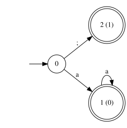
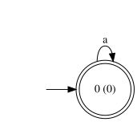
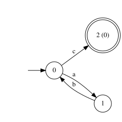

# Certified Split Points: Parallel Lexing Without Speculation

**Nicklas Nidhögg**, August 2026. Describes munch at commit `141b12e`, after the v1.1.1 release; that is the tree the
primary measurements were taken on, preserved by the `benchmark/split-points-2026-08` tag.

*A technical report on the mechanism behind `Lexer::is_split_point()`, `chunk_boundaries()`, and
`tokenize_all_parallel()`. The implementation, tests, and benchmarks live in this repository; this document states the
idea precisely, relates it to prior work, and reports where it applies.*

## Abstract

Scanning with a DFA is serial by construction: each transition depends on the state the previous byte produced, so in
the straightforward table-driven scanner considered here each byte introduces a state-dependent lookup, and the chain of
them bounds one input at roughly one load latency per byte. The standard escape is to split the input into chunks and
scan them concurrently, but a chunk's first byte arrives with the automaton state unknown, so existing approaches either
simulate from every state and merge (simultaneous automata), guess a state and patch up mispredictions (speculation), or
overlap chunks and verify convergence. This report instead revisits classical delimiter-based parallel lexing and
supplies its missing automatic certification step, implemented in munch: derive, from the compiled automaton of the
token set itself, a set of *certified split symbols*, bytes at which, on a completely tokenizable input, every
occurrence begins a token. Splitting immediately before such a byte preserves the token stream exactly, by construction,
with no speculation, no overlap, no merge beyond ordered concatenation, and no duplicate tokenization when the property
does not hold: the plan degenerates to a serial scan. We state the certificate and its one subtlety (a re-entrant
initial state invalidates the exemption that makes it usable), show that deriving it is a linear-time analysis of the
compiled table, prove the condition necessary as well as sufficient, measure 93-95% parallel efficiency at eight threads
on a 512 MiB corpus that does not fit in cache, and survey which grammars certify usable symbols. The survey grounds a
piece of folklore: for conventional tokenizations, line-based splitting of source text is sound when no token can span a
line, and one token kind that can, the block comment, is alone sufficient to destroy every useful certificate in the
surveyed C-like grammar.

## 1 The problem

A table-compiled scanner executes, per input byte, one transition: `state = table[row(byte) + state]`. The load that
produces the next state cannot begin before the previous state is known, so the scan is a serial dependency chain and
its throughput is bounded by the load-to-use latency of the cache holding the table. munch's serial loop sits at that
floor (see [performance.md](performance.md)), which means further speedup on one input must come from scanning several
regions of it at once.

Splitting is the obstacle. A scanner dropped at an arbitrary offset does not know the automaton state there: the offset
may fall inside a string, halfway through an identifier, or in the middle of a multi-byte operator. Any tokenization
computed from a wrong entry state is garbage until the scanner happens to resynchronize, and whether and when it
resynchronizes depends on the automaton and the input.

## 2 Prior approaches

Published solutions accept the unknown-state problem and manage it:

- **Compile the simulation into the automaton.** Simultaneous finite automata (Sin'ya et al.) take a state of the
  extended automaton to be a mapping from entry state to exit state, so one ordinary pass over a chunk yields that
  chunk's whole transfer function; the mappings compose associatively and chunks combine in a parallel reduction. The
  per-state simulation is paid at construction rather than at scan time, and the authors report almost no runtime
  overhead. The cost is the size of the constructed automaton: a state is a map on states, so the worst case is n^n from
  a DFA with n states and 2^(n^2) from an NFA, though for the expressions they survey it is usually far smaller: of the
  more than 20,000 SNORT expressions they measure, 98.6% give a D-SFA no larger than the square of the minimal DFA, 279
  exceed it and six exceed its cube. The reduction step also remains. Composition can also be applied directly instead
  of compiled in, and in that form it is the oldest answer of all: Hillis and Steele (CACM 1986) treat each character as
  a unary function on states, observe that the induced composition is associative, and recover the state after every
  character with one parallel-prefix operation; their worked example is lexing program text. Data-parallel finite-state
  machines (Mytkowicz et al., ASPLOS 2014) take the same route on SIMD and multicore hardware, enumerating transitions
  from every possible start state so that the enumeration is exactly the transition function, and citing Hillis and
  Steele as the basis for doing so; the correct computation is selected afterwards, so nothing is guessed and nothing
  needs repair. The cost is a factor of |Q| in work, which convergence reduces in practice, though the authors report
  that convergence to a single state is rare. The GPU lexer of Voetter (2021) applies the same scan to recover the
  complete state stream, the state after every input position rather than only each chunk's entry state. Holding one
  function table per input position costs `O(|Q|n)` space, so that work precomputes the reachable compositions and
  identifies each by an integer, reducing composition to a two-dimensional lookup: the same trade, paid in a table
  rather than in states.
- **Carry fewer entry states.** Composition is exact but pays for every state. A second family attacks that cost by
  shrinking the set a chunk must carry. Enumerative speculation (Jiang and Agrawal, PPoPP 2017) sits deliberately
  between the extremes: rather than speculating on a single state or enumerating all of them, it speculates transitions
  from several states chosen by a lookback over the preceding input. Reduced-interface DFAs (Borsotti et al.) attack the
  same overhead from the automaton side, cutting the number of starting states a chunk automaton must carry by combining
  an NFA's state reduction with deterministic transitions. What remains uncertain in this family is how much redundant
  work is left when a speculation misses, and with it the speedup.
- **Relocate cuts to a language's separators.** Parallel lexers have long been built by cutting near equal divisions and
  sliding each cut to a language-specific separator (Barenghi et al., Science of Computer Programming 2015). The
  separator and the search bound are chosen by hand, and finding a separator does not by itself remove the entry-state
  problem: the accompanying parallel lexical analysis enumerates the possible start states of a chunk rather than
  deducing one, each worker carrying one computation per alternative and up to four at once in the worst case. So the
  technique is separator relocation plus state enumeration, not a proof that the separator is safe. Its worked cases are
  the direct antecedent of Section 5: newline is a sound separator for JSON, since no non-trivia lexeme admits it, yet
  it is rejected in practice because generated JSON may contain none. Lua fails for a stronger reason than any
  certificate could address: its long brackets open with `[`, then n equals signs, then `[`, and close with the matching
  `]`, n equals signs, `]`. The two must agree on n, so the lexical grammar is not regular, the set of possible
  delimiters is unbounded, and with it the set of possible entry states; no fixed lookahead can decide which delimiter,
  if any, encloses a chunk. Barenghi et al. recover a workable schema only by constraining the language, admitting just
  `[[` and `]]` for strings and requiring multi-line comments to end at a newline, after which newline does serve as
  their split point. What is missing is any way to decide, from the token set alone, whether a proposed separator is
  sound.
- **Prescan for context.** Plex (Li et al., IPDPS 2021) removes the need for delimiters entirely. It derives a
  prescanning automaton from the lexer's own DFA, embedding the backtracking cases into it, and runs that automaton over
  the input to compute a transfer function per chunk; composing those functions yields each chunk's true entry state,
  after which the chunks scan in parallel with no language-specific analysis. The price is a pass over the input; the
  benefit is that it applies to grammars that certify nothing here.
- **Analyse the grammar for streaming.** StreamTok (Li, Yang, and Mamouras, ASPLOS 2026) is the closest methodological
  neighbour: it also analyses a maximal-munch token grammar statically, before any input, and also partitions grammars
  into those its technique serves and those it does not. What it computes differs. Its maximum token neighbour distance
  bounds how far a longest-match decision can depend on future input, which is what makes bounded-memory streaming
  possible; it derives no separators, and parallelising it is left as future work there.
- **Recover a restart point after an edit.** Incremental lexers (Wagner and Graham, *General Incremental Lexical
  Analysis*) face the mirror of this question: after an edit, how far back must re-lexing begin for the result to equal
  a full re-scan. They answer it dynamically and per edit, saving the batch machine's state with each token as it is
  created so analysis can restart at any token boundary, and tracking lookahead dependencies as they arise rather than
  bounding them in advance. The certificate answers a static question instead, once per token set and before any input
  exists. An incremental divide-and-conquer lexer (Hugo and Hansson, Chalmers MSc thesis 2015) takes the other available
  route, storing a result for every possible entry state of a fragment and composing the transition maps, which places
  it with the all-state family rather than with boundary certification.
- **Restrict the automaton.** Holub and Štekr's parallel DFA run is exact and efficient for *k-local* automata, where
  any k consecutive symbols force a unique state regardless of the start. The property is uniform over the whole
  automaton rather than per symbol, and a lexical grammar need not have it.
- **Realign after the fact.** Parallel tokenization for LLM vocabularies faces the same boundary problem, and the
  overlap-based answer to it, extending chunks so neighbours share a region and merging inside it, does not guarantee
  the sequential result. LoPT (2026) instead matches on character positions and adjusts chunk lengths dynamically to
  realign the segments, and proves the merged output identical to sequential tokenization.
- **Folklore delimiters.** Data systems split logs and CSV at newlines because "records do not contain newlines",
  adjusting the cut to the next delimiter (the widow/orphan pattern). The assumption is per-format, informal, and
  famously unsound for CSV with quoted newlines, which is why speculative CSV parsing exists as a research topic (Ge et
  al., SIGMOD 2019); massively parallel delimiter parsing (Stehle and Jacobsen, PVLDB 2020) attacks the same context
  problem on GPUs. Format-specific structural scans (simdjson, Mison, Parabix) hand-derive comparable facts per format.

What none of these do is ask the token set's own automaton *which bytes are safe*.

## 3 The certificate

The setting is a lexer in the usual longest-match loop: the scanner starts in the initial state, consumes bytes
recording the last accepting position, emits the token found there, and restarts in the initial state at the next byte.
Tokens are positive-length: acceptance counts only after at least one byte is consumed, so an accepting initial state
never emits the empty word and the loop always advances. `tokenize_all()` and `tokenize_all_parallel()`, the entry
points this report is about, enforce that by treating a zero-length acceptance as no match and halting at the offset,
which the caller sees as a short consumed count. The single-match `tokenize()` does not: on a nullable token set it
returns a match of length zero, which a caller looping over it must reject itself, as the `Tokenizer` does. The
composite system is therefore not just a DFA run; it is a DFA run that *resets at every token boundary*. The certificate
exploits exactly that reset.

**Definition.** Only transitions that can still end in acceptance can lie on an emitted token, so the certificate is
defined over those alone. Call a state *live* when some continuation from it accepts, and call a transition live when it
is defined and its target is live. A byte b is a *certified split symbol* of a compiled token set when no live state
consumes it live except, possibly, a non-re-entrant initial state. "Consumes" means the state has an outgoing transition
on b; "re-entrant" means some nonempty input returns the automaton to the initial state along live transitions; since
every compiled state is reachable, that is equivalent to the initial state having an incoming live transition.

**Theorem.** Let an input be completely tokenizable by the serial longest-match scan. Splitting it immediately before
any occurrences of certified split symbols and scanning the chunks independently, each from the initial state, produces
chunk streams whose ordered concatenation is exactly the serial token stream.

*Proof.* Consider an occurrence of a certified symbol b at offset i. Suppose, for contradiction, that i is not a token
boundary of the serial scan. Then b is consumed after a nonempty prefix of some token; let q be the automaton state
immediately before consuming b. Since q consumes b and b is certified, q can only be the initial state, and that
exemption is available only while the initial state is non-re-entrant. But q was reached after a nonempty prefix, so the
initial state would be re-entrant, a contradiction; and a non-initial q consuming b contradicts certification directly.
So every occurrence of b begins a token, and the serial scan is in the initial state exactly at i. The same argument
bounds the longest-match lookahead, which is what lets a chunk end where the serial scan does not. While matching the
last token before a boundary, the serial scanner may read past the accepting position hunting for a longer match. To
record an accepting position past the boundary it would have to consume the certified byte after a nonempty prefix along
a live transition, which the paragraph above just ruled out. It is not obliged to stop there: a dead transition on that
byte may exist, and the scan may read on through it, but nothing it finds afterwards can accept. Either way the last
accepting position lies at or before the boundary, and the chunk that starts there sees exactly what the serial scan
saw. Induction over the chunks gives stream equality. ∎

**Corollary (malformed input).** If the serial scan fails at some offset, every chunk before the failing one is fully
consumed with an identical stream, and the failing chunk stops at the same relative offset; the concatenated parallel
stream therefore has the serial stream as a prefix, but later chunks may independently emit tokens beyond the failure. A
caller must check every chunk's consumed length, which the parallel API returns per chunk, before treating the
concatenated output as a successful tokenization.

**The subtlety.** The initial state is exempted from "no live state consumes b live" because a token may legitimately
begin with b. That exemption is only sound while no input can *return* the automaton to the initial state mid-scan. A
nullable pattern breaks it: `kleene(text("a"))` minimizes to an accepting initial state with a self-loop on `a`, the
initial state is re-entrant, and the naive certificate wrongly certifies `a`; splitting `aa` then changes the token
stream. munch shipped exactly this bug and an external review found it: the fix conditions the exemption on the initial
state having no incoming table entry, and the regression suite carries the counterexample and a cyclic `(ab)*c` re-entry
case. The condition is not a refinement for completeness; without it the certificate is unsound.

The three automata below are drawn by munch itself, from the minimized tables it compiles for each token set. Double
circles are accepting states, labelled with the state number and the token identifier.

`a+` and `;`, where nothing enters state 0 and no other state consumes `;`, so `;` is certified:



`a*`, where state 0 accepts and re-enters itself on `a`:



`(ab)*c`, where state 0 is re-entered through the cycle `a`, `b`, with no self-loop anywhere:



The middle and right cases are why the condition is stated as an incoming transition rather than as a self-loop. In
both, the only state consuming the candidate byte is the initial one, so the naive rule would certify it: `a` in the
nullable case, and `c` in the cyclic case, where certifying it would split `abc` in the middle of its only token. A
self-loop test would catch the first and miss the second. `Lexer::is_split_point()` rejects the candidate in both and
accepts `;` in the first.

**Vacuous certificates.** A byte no live state consumes live is certified vacuously: no completely tokenizable input can
contain it, so the theorem's implication holds trivially. Such a byte is useless to a caller, and a planner searching
for one scans the whole input and finds nothing, so `is_split_point()` does not report it. The filter is mechanical
rather than a matter of inspection: a certified byte is consumed live only by the initial state, so it can occur in
valid input exactly when the initial state has a live transition on it, and the predicate reports that intersection.

**The condition is also necessary.** On a *trim* automaton, one where every state is reachable and can still reach an
accepting state, the test is not merely sufficient: a rejected byte always admits a witness. If some non-initial state
consumes `b`, take a nonempty `u` reaching that state and a `v` carrying `delta(q,b)` to acceptance; the input `ubv` is
one whole token, so its `b` at offset `|u|` begins nothing. If instead the initial state is re-entrant and consumes `b`,
the same construction works with `u` returning to the initial state.

Restricting to live transitions is what makes that work, and it is not cosmetic. A pattern denoting the empty language,
such as `any_of(Set{})`, leaves reachable states behind that can never accept, and minimization keeps them because a
partial automaton distinguishes a missing transition from a transition into a state that cannot accept. With the token
set `"ab"` followed by the empty language, alongside a plain `"b"`, a non-initial state consumes `b` on a branch that
matches nothing. Stated over the raw transition relation the definition would reject `b`, even though every `b` in any
input this lexer accepts is a whole token, so necessity would fail; stated over live transitions that one is invisible,
since its target can never accept, and `b` certifies as it should. The same restriction is what makes the useful set
correct: in that example the initial state has a transition on `a`, but only into the dead branch, so no live transition
on `a` exists and `a` is reported vacuous rather than usable.

The reachability half of trimness is enforced the same way, and for the same reason. Necessity is stated for a trim
automaton, so the implementation restricts to states the initial state can reach as well as to live transitions: a state
no scan can arrive in cannot place a symbol inside a token, so letting it de-certify one would be a false negative. A
DFA from `Builder::subset_construction()` never has such a state, because subset construction only ever emits states it
reaches; `dfa::Simulator` accepts any `Dfa`, including one assembled by hand, so it computes reachability rather than
assuming it. An unreachable transition back into the initial state is covered too, and would otherwise make the initial
state look re-entrant and defeat every certificate at once.

## 4 Deriving and using it

The certificate is derived by a linear-time analysis of the compiled transition table at construction time. A reverse
pass first marks the live states: the table is inverted into a predecessor list, the accepting states seed a worklist,
and every state that reaches one is marked. One scan then detects initial-state re-entry over live transitions, and a
256-by-state sweep certifies each byte value, ignoring transitions whose target is not live. The cost is `O(states ×
symbols)` in time, and the same in auxiliary space for the predecessor list. It is paid once, amortized into a build
that already did strictly more work to exist. The scanner's inner loop is untouched.

The public surface is three functions. `is_split_point(byte)` reports whether a byte is a useful certified split symbol,
the set defined above. `chunk_boundaries(input, chunks)` is the pure planner: it aims for equal divisions and slides
each interior boundary forward to the next such byte, returning offsets; when the useful certified set is empty, it
returns one chunk without scanning. `tokenize_all_parallel(input, chunks, sink)` executes the plan, one thread per
chunk, and for completely tokenizable input the theorem guarantees that concatenating the per-chunk streams gives the
serial stream. There is no speculation to retry, no overlap to verify, and no merge beyond concatenation.

The planner's cost deserves stating: for k requested chunks it performs at most k - 1 forward searches for a certified
byte, so its worst case is `O(kN)` over an input of N bytes when certified occurrences are rare, though k is normally a
small hardware-thread count and the searches start at equally spaced offsets. When the certificate holds no byte at all,
the planner returns the single whole-input chunk without scanning. A one-pass planner would reduce the worst case to
`O(N + k)`.

## 5 What certifies in practice

The certificate asks the grammar for cooperation, and the interesting question is how much real grammars give. The
following table was produced by compiling each token set with munch and reading `is_split_point` for all 256 bytes (the
probe is a shipped program, described in the appendix). Rows two through four each add a single token kind to the
grammar of row one rather than accumulating, so each collapse is attributable to the token kind named. The conventional
and split-friendly rows recognize exactly the same byte language and differ only in the tokenization, and the
block-comment row directly after them adds one token kind to the split-friendly grammar, so those three are read
together. The predicate already excludes vacuously certified bytes, so the column needs no further filtering.

| Token set                                               | Useful certified bytes             |
|---------------------------------------------------------|------------------------------------|
| C-like: identifiers, numbers, ws runs, operators, punct | all operator and punctuation bytes |
| the first row plus strings alone (no raw newline)       | none                               |
| the first row plus `//` line comments alone             | none                               |
| the first row plus `/* */` block comments alone         | none                               |
| JSON, the RFC 8259 lexical forms over bytes             | none                               |
| log lines (`[^\n]+` and `\n`)                           | `\n`                               |
| C-like, conventional: strings, `//`, ws runs with `\n`  | none                               |
| the same language, split-friendly tokenization          | `\n`                               |
| the same plus block comments                            | none                               |
| `keyword_scale_builder()`, construction-cost grammar    | 16 of those 24 bytes               |
| `build_lexer(false)`, the scaling grammar               | 13 of its own 14                   |

Three mechanisms explain the collapses:

- **Free-content tokens absorb the alphabet.** A string literal that may contain `(` makes `(` a mid-token byte,
  de-certifying it everywhere. One token kind with a near-total interior alphabet removes almost every candidate.
- **Run tokens de-certify their own bytes.** With whitespace tokenized as `[ \t\n]+`, the second newline of a blank line
  is consumed by the run's continuation state, so `\n` itself is mid-token-consumable and uncertified. This is easy to
  miss: the byte's *own* token kills it.
- **A multi-byte token de-certifies every byte that can follow its first.** The first row spells each operator as a
  single byte, so each is consumed only at the initial state and all twenty-four certify. The benchmark contains two
  C-like grammars and they disagree, so the last two rows name them. `keyword_scale_builder()` in
  `tools/benchmark/src/main.cpp` spells operators as literals including `++`, `==` and `->`, and admits a decimal point
  inside a number; every byte occurring after the first position of some operator gains a live mid-token state, and
  seven candidates fall that way: `=` `<` `>` `&` `|` `+` `-`. The `.` falls independently, not as an operator
  continuation but because `decimal_float()` admits it inside a number, bringing the total to eight.
  `build_lexer(false)` in `tools/benchmark/src/harness.cpp`, which produces the scaling table, has a smaller operator
  set in which every multi-byte operator has `=` as its only continuation byte, so only `=` is lost and 13 of its 14
  candidates certify. Both collapses are partial. What they show is that "operators certify" is a claim about the
  particular literals a grammar registers, so the grammar has to be named rather than described: these two C-like
  benchmark grammars recognize different operator and number languages, and they certify different sets. The sharper
  claim, that certification depends on the tokenization and not on the recognized language, needs a pair recognizing the
  same language, and the conventional and split-friendly rows below are that pair: identical token kinds and identical
  accepted input, differing only in whether newline is folded into the whitespace run, and certifying nothing versus
  certifying `\n`.

All three mechanisms point at the same design lever: certification is a property of the *tokenization* rather than an
intrinsic one, and a tokenization can sometimes be refactored without changing what is recognized at all. The
"split-friendly" row keeps the identical C-like language but tokenizes newline as its own single-byte token, leaves
spaces and tabs as whitespace runs, and keeps strings and comments line-bounded. The row directly above it is the same
language under the conventional tokenization and certifies nothing, which isolates the change. Then `\n` certifies, and
the folklore rule follows as a practical corollary: **for conventional tokenizations in which newline is its own token,
line-based splitting is sound when no other token can contain a newline.** The automaton-level statement remains the
exact one: "no token spans a line" is sufficient here but not necessary in general, since a token that merely begins
with newline leaves the certificate intact (newline is then consumed only from the initial state). Adding block
comments, the one token kind in this C-like tokenization that spans lines, destroys the certificate again, which is the
formal shape of both "you cannot chunk C by lines" and the quoted-newline problem that pushed CSV parsing into
speculation.

The JSON row above appears to contradict the literature, and the reconciliation is about the equivalence each result
preserves rather than about the automaton. Prior claims that JSON may be divided at newline (Barenghi et al. 2015,
restated by Plex) treat whitespace as unobservable trivia. Such a division can split one maximal whitespace match into
two ignored matches whose lengths sum to the original, leaving the observable non-trivia stream unchanged. The theorem
here preserves something stronger, the complete sequence of emitted kinds and lengths, and under that semantics a
newline inside a maximal whitespace token is not a certified boundary. The grammar surveyed here follows the RFC 8259
lexical forms over byte input, with the full string escapes, signed numbers with fraction and exponent, the three
literal names, and whitespace runs emitted as tokens, so it is refused exactly as it should be. It is a lexer over bytes
rather than a conforming JSON processor: string interiors admit any byte from `0x20` up except quote and backslash, so
UTF-8 well-formedness, which RFC 8259 requires of JSON exchanged outside a closed ecosystem, is assumed of the input
rather than checked here. That is orthogonal to certification, since validating it would only remove bytes from string
interiors and so could not de-certify anything that certifies now. The two results do not conflict; they quantify over
different streams. A scanner that discards trivia can therefore split safely at newline under the weaker
observable-stream equivalence, but the definition still rejects newline: the whitespace continuation state consumes it
either way. Recovering certification itself needs the tokenization changed, for instance by making newline its own token
as in Section 5, or the theorem extended to reason modulo ignored kinds.

## 6 Evaluation

The figures below come from `paper/data/bare-metal-pinned-run2/`, a full run on an AMD Ryzen 9 9950X3D under Ubuntu
26.04 with GCC 15.2 at -O2, whose `environment.txt` records the measured commit and a clean tree. The `performance`
governor was selected, which biases the clock toward its maximum without fixing it since boost stays enabled, the
topology is archived beside it as `lscpu -e`, scenarios ran in interleaved rounds, corpora swept 1 to 512 MiB, and every
pass of the ten scaling scenarios is recorded individually rather than summarized; the construction, planning and
thread-launch rows are summaries only. That run confines the process to the eight physical cores of one L3 domain, which
excludes the SMT siblings and the other domain from the set the scheduler may use, so eight threads have eight distinct
physical cores available; that constrains placement rather than fixing it, since threads may still migrate within those
cores. `paper/data/bare-metal-unpinned-run2/` is the same measurement free to use all 32 logical processors. Citing an
archive rather than the README's table keeps an ordinary benchmark refresh from silently changing what this report
claims.

A third archive, `paper/data/benchmark.txt`, holds an earlier run on an Intel i9-12900K under WSL2 with GCC 13.3, over
16 MiB cache-resident corpora in a fixed scenario order. It is kept because the contrast is a result in its own right,
below. Its environment bounds what it can establish and the report states those bounds rather than adjusting for them:
the guest sees a flattened topology, so a performance core cannot be told from an efficiency core and no thread is
pinned; no `cpufreq` interface is exposed, so turbo residency falls as cores get busy; the machine carried an ordinary
desktop load rather than being quiesced; and 16 MiB against a 30 MB last-level cache makes those warm-cache figures
throughout.

Two baselines answer different questions, and only one of them holds still between collections. Parallelism is measured
against the same API driven with a single chunk, which plans and uses the per-chunk sink but spawns nothing, reaching
730.1 MiB/s. Against that baseline the certified chunked scan reaches 1434.2 MiB/s on two threads, 2828.0 on four, and
5568.3 on eight, which is 98%, 97% and 95% parallel efficiency (95%, 93% and 93% in the other collection of the same
placement), on a 512 MiB corpus four times the machine's last-level cache. A caller choosing between the serial and
parallel entry points compares instead against the plain scan, which gives 3.46x at four threads in this run and 3.94x
in the other collection with the same placement. The certificate behind every one of these plans costs a linear-time
table analysis at build time and one boundary search per requested interior boundary at scan time.

Scaling does not depend on the corpus fitting in cache: eight-chunk efficiency at 512 MiB is the highest of the four
sizes, not the lowest, rising 80%, 92%, 94%, 95% across 1, 16, 128 and 512 MiB. The sweep never reaches a break-even
size, since eight chunks are already 6.4x the one-chunk API at 1 MiB; what it shows is where fixed overhead becomes
visible, at 1 MiB, where spawning eight threads costs about 40 us against a scan of roughly 1.4 ms.

The plain scan does not hold still, and that is why it is not the baseline the efficiencies use. Its comparison with the
one-chunk row has taken three values. On the older WSL2 machine one chunk measured 14% *below* the plain scan, and the
efficiencies quoted against it were correspondingly inflated to 99%, 97% and 81%. The bare-metal pinned placement was
then collected twice: in the first collection one chunk was 5.9% *above* the plain scan at 512 MiB, winning 13 of 15
same-round pairs; in the second it is 10.7% below, winning none of 15.

Those two collections are not a controlled repeat. They were taken at different commits, and between them the benchmark
began writing round-trip-safe CSV values and gained the four plan-and-execute scenarios that now run before the scaling
sweep. The scaling code is unchanged but the executable is not, so these are two benchmark revisions on one machine
rather than one experiment run twice. The largest differences are in the single-threaded rows and move the same way
under both placements: at 512 MiB on the dense corpus the plain scan rose 14.3% pinned and 17.4% unpinned while the
one-chunk row fell 3.7% and 3.8%. At that size the multi-chunk rows move much less, at most 0.8% dense and 1.4% source
pinned, 1.1% and 0.6% unpinned. That stability is specific to 512 MiB: across the whole sweep multi-chunk rows move by
as much as 5.9% pinned and 6.3% unpinned, both at 16 MiB. A single-threaded shift landing within 0.1 points under two
different affinities looks more like the revision than the scheduler, though nothing here isolates which. All four
collections are archived under `paper/data/`.

The consequence is that efficiencies measured against the one-chunk baseline moved two to four points between the
collections, 93% to 95% at eight chunks, while the end-to-end ratio moved 12%, which is why the first is quoted as a
narrow range and the second as a wide one.

The planner's own cost is measured across certificate densities in the same archive: 0.1 microseconds when certified
bytes are common, 1.02 ms when they are a megabyte apart, and 16.4 ms in the worst case of a certified byte absent from
a 16 MiB input, the two scanning cases agreeing on about 3.3 GiB/s, which is consistent with the O(kN) bound. Those
three come from `summary.txt` rather than the CSV, which records only the scaling scenarios.

That worst case is paid before any scanning begins, and on such an input the planner returns one chunk, so what follows
is the serial scan. Stating it end to end needs planning and scanning timed on one grammar over one input, which the
plan-only rows above do not give: they use a two-token grammar over a synthetic input while the scaling rows use the
C-like grammar over generated source, and adding those would compare different lexers over different inputs. A separate
scenario therefore times both phases together on the planning workload. With the certified byte absent the parallel
entry point takes 34.5 ms against 18.2 ms for the serial one, so choosing it costs 1.90x; with certified bytes every 40
bytes it takes 1.7 ms against 12.4 ms, a gain of 7.3x. Both emit 838861 tokens, or one, identically. The penalty is a
property of this planner, which is deliberately simple; the one-pass O(N + k) formulation reduces it to a single pass
over the input, under 5 ms here, rather than eliminating it. The distinction worth keeping is that deciding the
certificate touches no input, while locating its occurrences is a runtime scan.

Correctness is enforced at three levels. The benchmark checks that the chunked token stream is identical to the serial
one by exact (kind, length) comparison before any timing. The unit suite carries the certification counterexamples,
including the re-entrant-initial-state case. And the fuzzer generates arbitrary grammars and inputs, checks every
planned boundary against `is_split_point`, and compares the concatenated parallel stream with the serial stream on every
execution; local extended fuzzing and a bounded fuzzing job on every CI run have found no violation.

## 7 Limitations and future work

The approach trades generality for certainty: when the grammar does not cooperate, it offers no usable split points, by
design, and the speculation and composition families remain the only options. Several extensions look natural. A
*conditional* certificate over symbol pairs or short windows ("`)` followed by `\n`") would recover splitting for
grammars where no single byte certifies. A hybrid plan could split at certified bytes where they exist and fall back to
speculative entry elsewhere, keeping the guarantee where it is free and paying for it only where it is not. Finally, the
grammar-refactoring lever of Section 5 could be automated: given a token set, propose the minimal trivia re-tokenization
that makes a chosen byte certify.

## 8 Related-work summary

A certified split symbol is not a synchronizing word in the classical sense (Volkov's survey covers that theory): a
synchronizing word maps every state to one common state, whereas a certified symbol is one that no reachable mid-token
state may consume into a state from which acceptance remains reachable, so the surrounding longest-match loop must
already have finished its token and returned to the initial state before the symbol arrives. The reset comes from the
token loop, not from the automaton's transition structure.

Certified split points differ from simultaneous automata (no enlarged automaton, no composition), from speculation (no
guess, no re-run, exact by construction), from k-locality (the property is per-symbol and derived from the token loop's
reset, not uniform over the automaton), from realignment after the fact (nothing is merged or realigned), and from
delimiter folklore (the safe set is derived from the compiled token set rather than assumed per format, and the
derivation correctly refuses grammars where the folklore is unsound).

The contribution is therefore narrow and specific. Splitting at a delimiter is classical, and the observation that it
works for JSON but needs Lua's grammar constrained first is stated in the literature; what appears to be missing is the
automatic certification step those choices leave implicit, namely a sound grammar-only test of whether a given byte is a
safe separator. The certificate supplies that test from the compiled automaton, with no hand analysis and no
input-dependent context-recovery pass, and the survey in Section 5 turns the same machinery into a statement about which
token sets admit such bytes at all. The analysis is not only sound: restricted to the states from which acceptance is
still reachable, the condition is necessary too, so a rejected byte always admits an input placing it inside a token. To
our knowledge this condition, in particular the re-entrancy requirement, has not been published as a static per-symbol
property of the token DFA, though its components (synchronization, delimiter splitting, chunked scanning) are all
classical. That claim was checked against the parallel lexing and parallel DFA literature, the theory of synchronizing
automata, incremental lexical analysis, and the recent work on sequential (Reps 1998; Li and Mamouras 2025) and
streaming (Li, Yang, and Mamouras, ASPLOS 2026) tokenization. Each answers a neighbouring question: where to restart
after an edit, how to reset every state at once, how to avoid repeated rescanning, how to recover a chunk's entry state
after the fact. None asks which single bytes the token set makes safe in advance.

## References

- R. Sin'ya, K. Matsuzaki, M. Sassa. *Simultaneous Finite Automata: An Efficient Data-Parallel Model for Regular
  Expression Matching.* ICPP 2013. arXiv:1405.0562.
- T. Mytkowicz, M. Musuvathi, W. Schulte. *Data-Parallel Finite-State Machines.* ASPLOS 2014.
- P. Jiang, G. Agrawal. *Combining SIMD and Many/Multi-core Parallelism for Finite State Machines with Enumerative
  Speculation.* PPoPP 2017.
- A. Barenghi, S. Crespi Reghizzi, D. Mandrioli, F. Panella, M. Pradella. *Parallel parsing made practical.* Science of
  Computer Programming 112:195-226, 2015.
- L. Li, S. Sato, Q. Liu, K. Taura. *Plex: Scaling Parallel Lexing with Backtrack-Free Prescanning.* IPDPS 2021.
- A. W. Li, Y. Yang, K. Mamouras. *Static Analysis for Efficient Streaming Tokenization.* ASPLOS 2026, 1880-1896.
- T. Reps. *"Maximal-munch" Tokenization in Linear Time.* ACM TOPLAS 20(2):259-273, 1998.
- A. W. Li, K. Mamouras. *Efficient Algorithms for the Uniform Tokenization Problem.* PACMPL 9(OOPSLA1), 2025.
- T. A. Wagner, S. L. Graham. *General Incremental Lexical Analysis.* Manuscript, UC Berkeley, 1997.
  https://harmonia.cs.berkeley.edu/papers/twagner-lexing.pdf
- J. Hugo, K. Hansson. *A Generator of Incremental Divide-and-Conquer Lexers.* MSc thesis, Chalmers, 2015.
- J. Holub, Š. Štekr. *On Parallel Implementations of Deterministic Finite Automata.* CIAA 2009.
- C. Ge, Y. Li, et al. *Speculative Distributed CSV Data Parsing for Big Data Analytics.* SIGMOD 2019.
- E. Stehle, H.-A. Jacobsen. *ParPaRaw: Massively Parallel Parsing of Delimiter-Separated Raw Data.* VLDB 2020.
- G. Langdale, D. Lemire. *Parsing Gigabytes of JSON per Second.* VLDB Journal 2019 (simdjson).
- Y. Li et al. *Mison: A Fast JSON Parser for Data Analytics.* VLDB 2017.
- R. D. Cameron, K. S. Herdy, D. Lin. *High Performance XML Parsing Using Parallel Bit Stream Technology.* CASCON 2008
  (Parabix).
- W. Shao, L. Zheng, P. Wang, P. Zheng, J. Li, Y. Fan. *LoPT: Lossless Parallel Tokenization Acceleration for Long
  Context Inference of Large Language Model.* ACL 2026, 33107-33122. Preprint: arXiv:2511.04952.
- M. V. Volkov. *Synchronizing Automata and the Černý Conjecture.* LATA 2008.
- A. Borsotti, L. Breveglieri, A. Morzenti, S. Crespi Reghizzi. *Minimizing Speculation Overhead in a Parallel
  Recognizer for Regular Texts.* PPoPP 2025, 569-572.
- T. Bray (Ed.). *The JavaScript Object Notation (JSON) Data Interchange Format.* RFC 8259, STD 90, December 2017.
- W. D. Hillis, G. L. Steele, Jr. *Data parallel algorithms.* Communications of the ACM 29(12), 1986, pp. 1170-1183.
- R. Voetter. *Parallel Lexing, Parsing and Semantic Analysis on the GPU.* MSc thesis, Leiden University, 2021.

## Appendix: the applicability probe

The table in Section 5 is produced by `paper/figures/applicability.cpp`, which uses only the public API: it builds each
token set with `core::Builder`, reads `Lexer::is_split_point()` for every byte value, and asserts the result against the
published row, exiting non-zero if any row disagrees. The grammars are those listed, with `Set::all()`-derived interiors
carrying the exclusions the source shows: a string admits any byte but `"` and newline, a line comment any byte but
newline, and the block comment is written as `/* ( [^*] | *+ [^*/] )* *+ /`. The two benchmark rows are exact duplicates
of `keyword_scale_builder()` and `build_lexer(false)`, keyword lists and priorities included. Against an existing build
tree, from the repository root:

```
c++ -std=c++23 -I libs/common/include -I libs/core/include -I libs/dfa/include -I libs/nfa/include \
    -I libs/regex/include paper/figures/applicability.cpp -o /tmp/applicability \
    -L build/libs/core -L build/libs/dfa -L build/libs/nfa -L build/libs/regex \
    -lmunch_core -lmunch_dfa -lmunch_nfa -lmunch_regex -lpthread
/tmp/applicability
```
